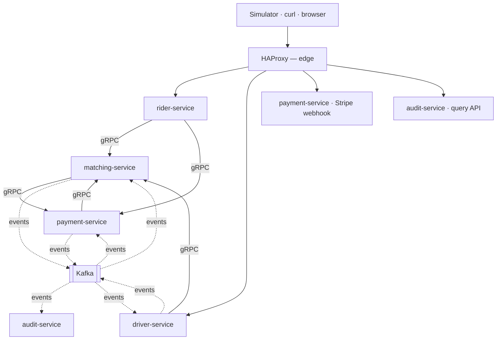
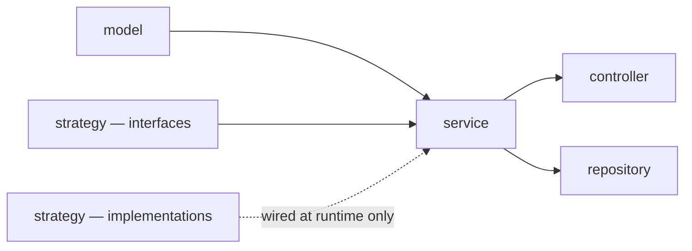
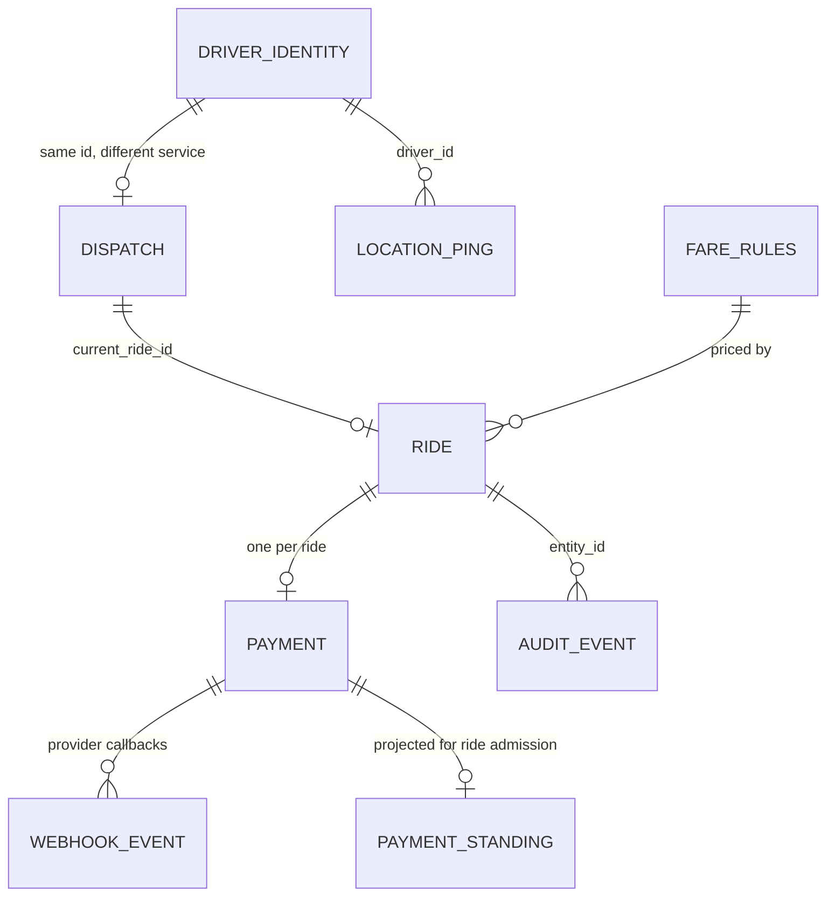
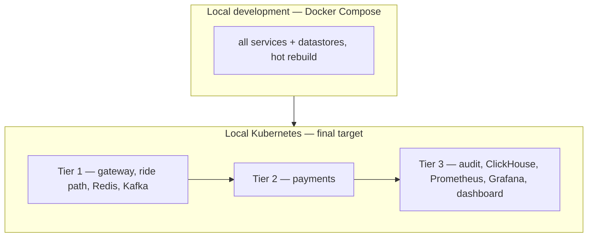

# Architecture Spine — Puber

## Design Paradigm

**Layered services with Strategy-swapped adapters, composed by an event backbone.**

Each service is internally layered — `controller` → `service` → `repository`, over an immutable
`model` — with a `strategy` package holding the implementations that vary over the project's
lifetime. Deliberately **not** hexagonal: the feature decomposition already happened at the
service boundary, so ports-and-adapters inside an already-feature-scoped service is ceremony.

The paradigm choice is driven by one observation: **Puber's roadmap is a sequence of five adapter
swaps** — HTTP→Kafka, Postgres→Redis for locations, Postgres→ClickHouse for analytics, stub→Stripe,
polling→WebSocket. Strategy interfaces exist at exactly those seams and nowhere else.

Between services, two transports with a strict division: **synchronous gRPC carries anything an
actor waits for a response to**; **Kafka carries propagation**. Kafka never replaces the
synchronous path, because the edge services own no data and must reach `matching-service` to get
a ride id, a rejection, or a read result.

## Invariants & Rules

### Dependency direction





---

### AD-1 — Database per service

- **Binds:** all services
- **Prevents:** any service reaching into another's tables because SQL made it possible
- **Rule:** each service owns a private Postgres database. No shared instance, no cross-database query, no foreign key spanning services. Two tables may share a name across services; they are unrelated.

### AD-2 — Co-written data shares one transactional owner

- **Binds:** all writes
- **Prevents:** a saga or compensating action anywhere in the core dispatch path
- **Rule:** if a single user-visible action writes two pieces of state, both live in one service's database and are written in one local transaction. Never coordinate a multi-step distributed transaction; if a design needs one, the boundary is wrong. This governs *synchronous co-writes*. Ride state and payment state are deliberately **separate machines advancing independently** (AD-41, AD-44) — neither waits on the other, and a late outcome is applied against current state rather than rolled back. That is not a distributed transaction and does not violate this rule.

### AD-3 — Service ownership

- **Binds:** all persistence
- **Prevents:** ride state and driver availability landing in different databases, which would force cross-service coordination on every dispatch
- **Rule:** `rider-service` owns nothing (stateless façade). `driver-service` owns driver identity and location only. `matching-service` owns `rides`, its own dispatch `drivers`, `fare_rules`, and AD-59's `payment_standing` projection — a **derived read model, never a second owner**: it is fed only by payment events, written by no other service, and authoritative for nothing. `payment-service` owns `payments` and `webhook_events`. `audit-service` owns `audit_events`, the ClickHouse tables, and the columnar location-ping history (AD-60) — a separate stream on its own topic and consumer group, never a partition of the audit trail. **Redis is owned solely by `matching-service`** — it is the only writer of both the geo set and the position keys, because membership requires dispatch status that only it holds; `driver-service` contributes positions by publishing events, never by writing Redis.

### AD-4 — Caches are advisory; the owning row is authoritative

- **Binds:** Redis geo set, Redis position keys, driver-identity snapshot
- **Prevents:** a stale cache read causing a double-booking rather than a retry
- **Rule:** a cache may only select candidates. Every state change is decided by a conditional `UPDATE` against the owning row; the loser re-searches. Never trust a cache for correctness.

### AD-5 — The gateway exposes edge services only

- **Binds:** HAProxy routing
- **Prevents:** `matching-service` becoming publicly reachable, which would make the façade layer optional and let clients bypass it — and the route list drifting from "the actor-facing edge" into "everything that speaks HTTP", which is the distinction this rule exists to hold
- **Rule:** the gateway carries **actor-facing traffic only**, and routes only to `rider-service`, `driver-service`, the Stripe webhook, and audit's query API. `matching-service` is never publicly routable, and `payment-service` is routable for **the Stripe webhook alone** — that one endpoint exists because the provider must reach it, and no other `payment-service` surface is a route: a rider reads a payment outcome through `rider-service` (AD-61), never `payment-service` directly. Internal hops bypass the gateway entirely. **Operator and observability surfaces are deliberately not routes:** FR-39's refund trigger, FR-50's live dashboard, Prometheus and Grafana are reached directly inside the cluster. That is a *stronger* boundary than a route rather than a looser one — nothing outside the cluster reaches them at all — and it is why the list grows when a new **actor** appears and never when a new operator surface does. Each such surface **mints its own request id at entry** (AD-54), since no gateway did it for them.

### AD-6 — Queue bounds form one chain, sized from the scarcest resource outward

- **Binds:** HAProxy, Tomcat, HikariCP, Resilience4j bulkheads, `event_outbox`
- **Prevents:** an edge bound that merely relocates the queue into a layer with no observability
- **Rule:** every queue in the request path has an explicit bound, and the tightest bound sits where there is visibility — HAProxy — so overflow sheds with a 503 rather than piling up inside the JVM. A bigger queue is not a fix; it converts a throughput problem into unbounded latency.

### AD-7 — Layered packaging with Strategy for varying behaviour

- **Binds:** all services
- **Prevents:** five independently built services inventing five internal structures
- **Rule:** `controller` / `service` / `repository` / `model` / `strategy` / `config`. The domain package is named `model`, never `entity` — the latter implies JPA, and there is no ORM.

### AD-8 — One-way dependency inside a service

- **Binds:** all services
- **Prevents:** a concrete adapter import silently un-swapping a Strategy and breaking the stub payment path
- **Rule:** `model` imports nothing framework-flavoured; `service` imports `model` and Strategy **interfaces**, never an implementation; `controller` imports `service`; nothing imports `controller`.

### AD-9 — `matching-service` alone splits by feature

- **Binds:** `matching-service`
- **Prevents:** cyclic packages, and the split being copied into single-domain services where it is ceremony
- **Rule:** packages `shared`, `fare`, `ride`, `dispatch`, `quote`, ordered one-way `shared ← fare ← ride ← dispatch ← quote`. The match transaction and the surge scheduler both live in `dispatch` precisely because it sits above `ride` and `fare`. Layer by default; split by feature only where a service holds more than one domain.

### AD-10 — Strategy interfaces only where implementations vary — never over Postgres

- **Binds:** `PaymentProvider`, `PaymentGateway`, `Clock`, `DriverLocationIndex`, `EventTransport`
- **Prevents:** tests passing against a fake repository that lacks the locking semantics NFR-1 depends on
- **Rule:** introduce an interface where a second implementation genuinely exists. Repositories take no interface: race-safety **is** Postgres's behaviour (row locks, partial unique indexes, conditional updates), so tests run against the **real datastores in the Compose stack** — never a fake, an in-memory substitute, or a different SQL dialect. See AD-56 for the isolation this obliges.

### AD-11 — State machines are explicit transition tables

- **Binds:** ride lifecycle, payment lifecycle
- **Prevents:** validity scattered across `if` checks, so a replayed event can advance state twice
- **Rule:** each machine is an enum plus an allowed-transitions map in `model`. Illegal transitions raise a domain exception. This is what makes NFR-4's replay-safety structural rather than remembered.

### AD-12 — All services carry the `-service` suffix

- **Binds:** service names, directories, Kubernetes resources
- **Prevents:** mixed `api` / `engine` / `service` naming implying three different kinds of component
- **Rule:** `rider-service`, `driver-service`, `matching-service`, `payment-service`, `audit-service`. Java packages stay suffix-free (`com.puber.rider`).

### AD-13 — Ride state machine

- **Binds:** FR-9–FR-19, FR-22–FR-24
- **Prevents:** `MATCHED` meaning both "offer outstanding" and "driver accepted", which leaves the offer-timeout sweep nothing to filter on
- **Rule:** `REQUESTED → WAITING_MATCH → OFFERED → MATCHED → IN_PROGRESS → COMPLETED`, plus terminals `CANCELLED`, `NO_DRIVER`, `PAYMENT_FAILED`. `REQUESTED` means *awaiting authorisation* and nothing else; it is entered exactly once and never returned to, so a ride holding funds can never fall back into re-authorising them. Recovery returns to `WAITING_MATCH`.

### AD-14 — One active ride per rider, enforced by a partial unique index

- **Binds:** FR-3
- **Prevents:** the check-then-insert race, with no rider row available to lock
- **Rule:** `CREATE UNIQUE INDEX ... ON rides (rider_id) WHERE status IN ('REQUESTED','WAITING_MATCH','OFFERED','MATCHED','IN_PROGRESS')`. A concurrent second request fails on the constraint and becomes a 409. The index holds only active rides, so it stays small regardless of total volume. This rule governs *concurrency* alone — whether a rider's **previous** ride has settled is a separate admission check on a different mechanism (AD-59), because no index in `matching-service` can see payment state.

### AD-15 — Every transition is a guarded conditional update, with fixed lock ordering

- **Binds:** all ride and dispatch writes
- **Prevents:** lost updates, double-booked drivers, and deadlock between transactions touching both tables
- **Rule:** every write carries its expected prior state **and** the acting identity in the `WHERE` clause; zero rows affected means rejected, never silently retried as success. Any transaction touching both tables takes **`rides` first, then `drivers`**.

### AD-16 — `BUSY` spans the whole engagement

- **Binds:** dispatch status, FR-20
- **Prevents:** an `AVAILABLE` driver with an outstanding offer receiving a second one
- **Rule:** dispatch status is `OFFLINE | AVAILABLE | BUSY`; `BUSY` is set at **offer** time and cleared on release or completion, so `status = 'AVAILABLE'` is the *declared* half of matchability — the full test is AD-21's conjunction with a fresh heartbeat, and neither half alone is sufficient. Because `BUSY` spans offer and ride, the go-offline guard reads the **ride's** state, not the dispatch status: `OFFERED` releases and permits, `MATCHED`/`IN_PROGRESS` refuses.

### AD-17 — Declined and expired drivers are excluded from re-offer

- **Binds:** FR-11, FR-23
- **Prevents:** a declining driver — still nearest, back in the geo set — being re-offered the same ride until the `NO_DRIVER` window burns out
- **Rule:** the ride carries `declined_by UUID[]`; matching filters `NOT (driver_id = ANY(declined_by))`. Offer timeouts append to it as well as explicit declines. No separate offers table — the durable history is the audit trail.

### AD-18 — Provenance is a field, not a state

- **Binds:** FR-14, terminal ride states
- **Prevents:** every "completed rides" query having to match two values, where missing one silently drops auto-completed rides from a report or a capture
- **Rule:** an auto-completed ride ends in `COMPLETED` with `completed_by = DRIVER | SYSTEM`. Generalises: how a state was reached is a column, never a distinct state.

### AD-19 — Matching reads only `WAITING_MATCH`

- **Binds:** FR-9, FR-10
- **Prevents:** dispatching a ride whose funds are not yet held
- **Rule:** the matching query selects `status = 'WAITING_MATCH'` alone. An unfunded ride is therefore *invisible* to dispatch rather than rejected by a guard someone must remember to write.

### AD-20 — Matching runs as a claim-loop worker pool, the single offerer

- **Binds:** FR-10, FR-11, FR-23
- **Prevents:** two offer paths that must stay consistent, and an autoscaler that multiplies failing searches during a driver shortage
- **Rule:** a small fixed pool claims batches with `FOR UPDATE SKIP LOCKED`, processes, and re-claims; it waits only on an empty claim. Decline and timeout **release only** — offers are made in exactly one place. Pool size is derived from arrival rate × match time, never scaled on backlog depth: a `WAITING_MATCH` backlog usually signals missing supply, which more workers cannot fix.

### AD-21 — Declared status and observed reachability are separate facts

- **Binds:** FR-29
- **Prevents:** a tunnel ending a driver's shift and requiring manual recovery
- **Rule:** dispatch status is written only by the driver's own action, the ride lifecycle, or session expiry — **never** by loss of signal. Matchability is `AVAILABLE` **and** a fresh heartbeat. A returning driver becomes matchable on their next heartbeat with no transition.

### AD-22 — Session expiry ends a shift after prolonged absence

- **Binds:** FR-30
- **Prevents:** Monday's shift leaking into Wednesday, putting a driver online without their action and contradicting FR-20
- **Rule:** an **idle** driver unreachable for one hour is set `OFFLINE` with a `SYSTEM` audit event and must explicitly go online again. Applies only to drivers holding no ride, and the window must remain strictly longer than the `IN_PROGRESS` staleness window.

### AD-23 — Heartbeats are stamped at produce time

- **Binds:** FR-26, FR-29, all staleness windows
- **Prevents:** consumer lag masking staleness — a backed-up consumer makes every vanished driver look freshly heard, failing worst under load
- **Rule:** `driver-service` stamps the timestamp when producing; consumers never re-stamp on receipt. Staleness windows are sized to absorb clock skew plus plausible lag.

### AD-24 — Driver display identity is snapshotted onto the ride

- **Binds:** FR-6
- **Prevents:** a cross-service call on every rider poll for a value that never changes
- **Rule:** the driver's display identity is copied onto the ride at offer time and cleared on release. It travels to `matching-service` on the go-online call, so no extra fetch is needed. The snapshot is also more correct — it records who actually drove.

### AD-25 — Grid size is a scenario parameter

- **Binds:** FR-10, NFR-2
- **Prevents:** a 5 km matching radius exceeding the whole grid, so it filters nothing and nearest-driver degenerates into sorting every available driver
- **Rule:** geographic bounds are configuration, not a constant — a small square at fixture scale, roughly 20 km across at stress scale so driver density stays realistic and the radius does real work. Fixture coordinates are generated relative to the configured bounds.

### AD-26 — Redis holds the matchable geo index and every driver's position

- **Binds:** FR-26, FR-28, FR-6
- **Prevents:** over-fetching ineligible candidates when most drivers are busy, and losing the position of a driver who is on a ride
- **Rule:** two structures with deliberately different populations — a geo set containing **matchable drivers only**, searched with `GEOSEARCH`; and a per-driver position key covering **every** driver, TTL'd longer than the longest staleness window, serving point lookups and all staleness comparisons. Two writes per heartbeat, pipelined, and **zero Postgres writes**. Stale geo members are removed lazily on encounter. **Absence is never evidence of staleness:** a sweep may act only on a recorded timestamp older than its window, never on a missing key. Redis holds no persistence (AD-27), so after a restart every key is absent while the drivers behind them are perfectly healthy — treating that as staleness would auto-complete and capture every in-flight ride at once.

### AD-27 — Redis is a cache, configured as one

- **Binds:** Redis deployment
- **Prevents:** clustering a single hot key, and paying fsync latency on the system's hottest path
- **Rule:** one instance, no cluster (the geo set is a single key, so sharding by key cannot help), no persistence (every value rebuilds within one heartbeat cycle), `noeviction` with generous headroom. Read replicas are the first scaling lever and are safe because the geo set is advisory. Redis is never a source of truth.

### AD-28 — Domain events are published through a transactional outbox

- **Binds:** all domain events
- **Prevents:** the dual-write split — committed state with a lost event, or an event with no state — and any interface pretending a synchronous call and an async publish are the same thing
- **Rule:** domain code never publishes; it writes an `event_outbox` row in the same local transaction as the state change, and a relay ships it. **Heartbeats never use the outbox** — location pings are ephemeral telemetry, not state transitions, and would put the hot-row write pattern back into Postgres.

### AD-29 — Outbox rows are claimed and deleted, never tracked by a cursor

- **Binds:** `event_outbox`, the relay
- **Prevents:** timestamp ordering, which a backwards clock or replica skew can invert — and, more dangerously, a high-water-mark relay that loses events permanently
- **Rule:** the primary key is a `GENERATED ALWAYS AS IDENTITY` bigint, assigned from one authority rather than from a replica's clock. **Assignment is ordered; commit visibility is not** — a transaction holding a lower id can commit after one holding a higher id. A relay that remembered a cursor (`WHERE id > lastSeen`) would therefore skip the late-committing row **forever**, reintroducing exactly the dual-write loss AD-28 exists to prevent. The relay must therefore **claim and delete**, never advance a watermark: rows are selected by claimability, locked with `SKIP LOCKED`, and removed on success, so a late arrival is simply picked up on the next pass. `occurred_at` records when the event happened and is never used for ordering.

### AD-30 — The payload is the built event, as JSON

- **Binds:** all event payloads
- **Prevents:** an event describing state as of publish time rather than transition time, and a serialised object that only one language can read
- **Rule:** the fully-formed event is serialised at transaction time. Never store the entity to be rendered later — the relay runs seconds afterwards, by which point the ride may have moved on. Never native language serialisation: consumers are independently built with duplicated domain code, so a serialised Java object would force the shared library the project rejects.

### AD-31 — Envelope carries routing; body carries meaning

- **Binds:** event envelope, `event_outbox` columns
- **Prevents:** the relay parsing payloads, and therefore needing per-event-type domain knowledge
- **Rule:** anything infrastructure or a cross-cutting consumer must read for every event type is promoted to an envelope column — `event_id`, `event_type`, `entity_type`, `entity_id`, `actor_type`, `actor_id`, `schema_version`, `occurred_at`, and `request_id`. `entity_type`/`entity_id` deliberately match `audit_events`, so one vocabulary spans both tables. `request_id` carries the gateway's identifier into the asynchronous world, so a trace does not end where the request does.

### AD-32 — Events are fat, bounded to a deliberate contract

- **Binds:** all event payloads
- **Prevents:** consumers calling back per event — a callback storm that also records state as of the callback rather than the transition
- **Rule:** an event carries what its consumers need inline. It is a contract, not a row dump: include what is genuinely consumed and nothing more, because every extra field becomes one that can never be removed.

### AD-33 — Contracts evolve by addition only

- **Binds:** event payloads, gRPC `.proto` definitions
- **Prevents:** a mutated live contract silently breaking every existing consumer
- **Rule:** adding a field is safe; removing, renaming, retyping, or **changing what a field means** is breaking and requires a new `event_type` or message alongside the old one. Protobuf field numbers are never reused. Consumers must ignore unknown fields — note a hand-built Jackson `ObjectMapper` fails on them by default, which is exactly where Kafka consumer configs build their own.

### AD-34 — Outbox retries are per row, with the breaker checked before claiming

- **Binds:** the outbox relay
- **Prevents:** one poison event rolling back its batch and stalling the stream forever; and a brief outage burning every event's retry budget and mass-dead-lettering the outbox
- **Rule:** success deletes the row, failure increments `tries` and pushes `next_attempt_at` out by exponential backoff, and the batch commits once so successes persist regardless of neighbours. At the cap, `dead_at` is stamped and the row stops being claimed. **The circuit breaker is evaluated before touching the database**, so rows that were never fetched cannot have their `tries` incremented; probe with a small batch while half-open.

### AD-35 — The outbox is a bounded queue that sheds on backlog age

- **Binds:** `event_outbox`, ride creation
- **Prevents:** an unbounded queue silently accumulating unpublished truth while the backbone is down
- **Rule:** past the bound, new ride requests are shed with a 503 rather than accepting work the system cannot record. The trigger is backlog **age**, not depth — a large backlog draining healthily is fine; a small one that has not moved is broken. **The age metric counts only claimable rows (`dead_at IS NULL`).** Dead rows remain in the table by design (AD-34), so including them would let a single poison event age the backlog forever and shed *every* ride request permanently — turning one bad message into a total outage. Dead rows are tracked by their own gauge, which alerts rather than sheds. The bound is derived as arrival rate × the outage duration to ride out, and drain rate must exceed arrival rate with headroom.

### AD-36 — Kafka producers key by entity; consumers are idempotent

- **Binds:** all topics and consumers
- **Prevents:** one entity's events processed out of order across partitions, and a redelivery advancing state twice
- **Rule:** every producer sets the partition key to the entity id. Every consumer is idempotent, deduplicating on `event_id` — a system-wide rule, not a payments concern. New consumer groups start at `earliest`. Where a consumer's write is a guarded transition, the guard supplies idempotency for free.

### AD-37 — REST at the edge, gRPC between services

- **Binds:** all inter-service calls, all public endpoints
- **Prevents:** a mixed transport story, and the assumption that Kafka removes the synchronous path
- **Rule:** everything through the gateway is REST — curl, a browser and the Simulator are first-class clients. Every internal synchronous hop is gRPC; the edge services are protocol translators. Kafka carries propagation only: anything an actor waits on a response for stays synchronous, because the façades own no data. An edge service may therefore **fan out to more than one owning service within a single request** — `rider-service` reads ride detail from `matching-service` and the payment outcome from `payment-service` (AD-61) — since owning no data is precisely what makes translation its whole job.

### AD-38 — One error vocabulary, mapped at the façade

- **Binds:** all endpoints, all gRPC services
- **Prevents:** five services answering "the guarded update affected zero rows" five different ways, and a 403 confirming a resource exists
- **Rule:** public errors are RFC 9457 Problem Details carrying the gateway's request id. Mapping: wrong state → `FAILED_PRECONDITION` → 409; one-active-ride → `ALREADY_EXISTS` → 409; identity mismatch or absent → `NOT_FOUND` → **404, never 403**; lost race → `ABORTED` → retried internally and never surfaced; malformed → `INVALID_ARGUMENT` → 400; shed → `UNAVAILABLE` → 503. Two rows deviate from gRPC's canonical HTTP mapping deliberately: `FAILED_PRECONDITION` and `ALREADY_EXISTS` both surface as 409 rather than 400/409 respectively, because to a rider they are the same event — the request conflicts with the ride's current state. The house mapping wins over the canonical one; it is written here so the deviation is a decision rather than a bug.

### AD-39 — Rider-scoped resources hang off the ride, and internal ids stay internal

- **Binds:** rider-facing endpoints
- **Prevents:** driver identifiers appearing in rider-facing URLs, giving something to enumerate before any check runs
- **Rule:** rider-scoped data is addressed as a sub-resource of the ride, never of the other actor. Responses carry the driver's name, not their identifier. This is correct shape rather than a security boundary — identity is trusted as-is under FR-48.

### AD-40 — Ride reads are split by volatility

- **Binds:** FR-5, FR-6
- **Prevents:** one fast-changing field making the entire resource uncacheable
- **Rule:** ride detail (slow-changing: status, assigned driver) is a separate endpoint from live driver position (changing every heartbeat). Detail uses `ETag` / `If-None-Match` and answers 304 on the common path; position returns coordinates **and** ETA from one Redis read. The two may be polled at different rates.

### AD-41 — No driver is dispatched until funds are held, asynchronously

- **Binds:** FR-9, FR-34
- **Prevents:** ride creation blocking on the payment provider, and the provider sitting in the path of every request at stress scale
- **Rule:** the ride is persisted as `REQUESTED` and its id returned immediately; authorisation proceeds asynchronously and moves the ride to `WAITING_MATCH` or `PAYMENT_FAILED`. The handler applying that outcome does exactly one guarded transition, which makes it idempotent without a dedupe table.

### AD-42 — Payment tokens are typed and transit-only

- **Binds:** FR-2, NFR-10
- **Prevents:** a token escaping into a log line, a stack trace, or a serialised response by accident
- **Rule:** the token is a dedicated value type whose `toString()` is masked, never a bare string; it is never persisted, never echoed, and passes through to `payment-service` as the only component that talks to the provider. Redaction is an application concern — the gateway cannot see body fields.

### AD-43 — Two payment strategies, at two layers

- **Binds:** `matching-service`, `payment-service`, NFR-8
- **Prevents:** conflating "there is no payment service yet" with "there is no provider", which are different problems at different layers
- **Rule:** `matching-service` holds an outbound gateway strategy — call `payment-service`, or signal authorised immediately. `payment-service` separately holds a provider strategy — real provider, or stub for the stress test and for any run with no provider credentials configured. The provider strategy carries AD-58's full settlement outcome set — the three-way capture answer (settled, provably uncapturable, or neither) **and the two-way void answer** — and the stub must be able to produce every one of them, or the retry-until-settled path, `CAPTURE_FAILED`, and the durable void are never exercised outside production. The stress exclusion swaps the **provider**, keeping the whole payment state machine in the flow, rather than skipping the path and exercising code that does not exist in production. **The immediate-authorise gateway is confined to phases before `payment-service` exists, and to runs with no `payment-service` in the stack.** It is explicitly **not** a runtime degradation for a payment-service outage: auto-authorising while payments are merely *unavailable* would dispatch rides against funds nobody holds and capture against `payments` rows that were never created, breaking FR-9. When payments exist but are down, rides stall (AD-48).

### AD-44 — A terminal ride never leaves an outstanding authorisation

- **Binds:** FR-16, FR-36, FR-40
- **Prevents:** a hold stranded against a dead ride when cancellation lands while authorisation is still in flight
- **Rule:** **one mechanism covers both timings, not two.** A ride reaching `CANCELLED` or `NO_DRIVER` stamps `void_requested_at` on its payment, guarded `WHERE status IN ('INITIATED','AUTHORIZED') AND void_requested_at IS NULL`, and AD-58's worker drives the void from there. It therefore does not matter whether the terminal event arrives before or after the authorisation resolves: arriving early it records the intent rather than no-opping, and **the authorisation result never voids inline** — resolving to `AUTHORIZED` it simply leaves the stamped row for the worker, so the invariant survives a restart instead of depending on an in-process call completing. A *declined* authorisation resolves to `FAILED` regardless of the stamp — there is no hold to release — so `VOIDED` is reachable only from `AUTHORIZED`. **`COMPLETED` never stamps a void**; a delivered trip is captured (AD-58), which is why the stamp is written by the two no-trip terminal states rather than by "any terminal state". **No automatic voiding sweep** — an authorisation that merely looks stale may belong to a long live trip, and voiding it would leave a completed ride with nothing to capture. A stamped void is the opposite of that sweep: it acts on a fact the ride machine recorded, never on a hold's age. **A hold has exactly three endings — captured, voided, or provably uncapturable (AD-50) — so this invariant holds with no carve-out.** A `COMPLETED` ride whose capture is still retrying is not a stranded authorisation but a live pursuit (AD-58) that resolves into one of those three; and a `CAPTURE_FAILED` hold is one the provider has already released. AD-58's capture worker is the inverse of a voiding sweep: it drives a hold to settlement rather than abandoning it on a timer. The invariant is asserted in tests and monitored by an alert.

### AD-45 — Bound outcomes the system can determine; never bound a wait for external truth

- **Binds:** FR-9, FR-12
- **Prevents:** a timeout that frees a rider to request again while their first hold is still outstanding — doubling holds across every stuck rider at once, against a rate-limited provider, exactly when the system is least able to cope
- **Rule:** `NO_DRIVER` is bounded, because "we looked and found nobody" is an answer the system holds. A ride awaiting authorisation is **not** bounded by a timeout; it is surfaced as a metric and an alert, and the rider's own cancellation is the exit. A stuck ride also blocks that rider from requesting another, which throttles load naturally during an outage.

### AD-46 — Time constants are one tuned set with fixed ordering

- **Binds:** FR-11, FR-12, FR-13, FR-14, FR-21, FR-26, FR-29, FR-30, FR-51 (the `CAPTURE_FAILED` cooldown)
- **Prevents:** independently chosen intervals that interact badly — a poll slower than the offer window, or a staleness window shorter than plausible clock skew
- **Rule:** heartbeat 2 s; driver poll 2 s (one client timer serves both); offer timeout 10 s; worker idle backoff 500 ms; `NO_DRIVER` budget 60 s; idle staleness 15 s; `MATCHED` staleness 90 s; `IN_PROGRESS` staleness 10 min; `CAPTURE_FAILED` cooldown 30 min; session expiry 1 h. **The `NO_DRIVER` budget is accumulated time spent in `WAITING_MATCH` only** — it does not run while a ride is `OFFERED` or `MATCHED`. Measured as wall time since request it would be shorter than the 90 s `MATCHED` staleness window, so a ride salvaged from a silent driver (FR-13) would be killed as `NO_DRIVER` on the very next sweep, making the salvage path unreachable in every case rather than occasionally. **The `CAPTURE_FAILED` cooldown (AD-59) is measured on wall clock** from the `capture_failed_at` recorded on the payment of AD-59's **anchor ride** — the rider's most recent ride, which is what "most recent `CAPTURE_FAILED`" designates and the only reading that keeps AD-59's two arms a partition. Restarted by each new one, never stacked. It is the Timestamps convention's *wall-clock for recorded facts* case, not its *monotonic for deadlines within a process* case, because it is a stored fact compared across restarts and across two services; an in-process deadline could not survive either. The **ordering is the invariant** and must survive any retuning: `poll ≪ offer timeout`; `idle < MATCHED < IN_PROGRESS < capture-failed cooldown < session expiry`; every staleness window comfortably exceeds clock skew plus lag; and no seeking budget is consumed by time spent not seeking. The cooldown's two bounds each carry a reason. It **exceeds `IN_PROGRESS` staleness**, the system's bound on a single trip, because a cooldown shorter than one ride refuses nobody in practice — any rider taking normal-length trips would have been occupied longer than the window anyway, so it would lapse before it ever bit. It stays **below session expiry** because it is a self-clearing cooling-off window, not standing: the longest this system holds anything against an actor is one shift, and a refusal outliving that is a debtor flag by another name — deliberately out of scope, and the self-clearing is what keeps this admission control instead.

### AD-47 — Capacity is derived, not guessed

- **Binds:** connection pools, thread pools, worker pools, replica counts, partition counts, storage ceilings
- **Prevents:** oversized pools that relocate queueing into Postgres, where it is invisible and each connection costs real memory — and a dimension being sized by instinct because this rule never claimed it
- **Rule:** size every pool as arrival rate × service time. The result is usually smaller than instinct suggests — ride writes need single-digit database concurrency, and the read path barely touches Postgres at all because detail reads answer 304 and position reads are Redis-only. **Storage is derived the same way:** the disk bound for Postgres and for the columnar store is ingest rate × the window to retain, with headroom — AD-35's derivation applied to bytes rather than to queue depth. AD-60's ping ceiling is the one that matters, since pings outnumber audit events by roughly 130:1 and a bound on the audit table is near-cosmetic beside it. Concrete values, storage included, are set from measurement under the NFR-2 stress run.

### AD-48 — A component may be turned off exactly when it sits behind an event boundary

- **Binds:** deployment, NFR-2, NFR-7
- **Prevents:** discovering under resource pressure which components are load-bearing
- **Rule:** Tier 1 — gateway, the three ride-path services and their stores, Redis, Kafka — is required. Tier 2 — `payment-service` — degrades to rides stalling before dispatch. **That tiering is a constraint on every later design, not just a description:** AD-59's admission check reads a local projection precisely to preserve it, because a synchronous check against `payment-service` on the ride-request path would promote it to Tier 1 by making ride requests impossible during its outage. Tier 3 — `audit-service`, ClickHouse, Prometheus, Grafana, the live dashboard — may be disabled with nothing breaking, and loses no data because consumer offsets survive and the backlog drains on return. Anything on the synchronous request path is not optional.

### AD-49 — Deployment is declarative and reconciled from git

- **Binds:** FR-47, NFR-7
- **Prevents:** cluster state drifting from the repository with no signal
- **Rule:** manifests live in the repository and a GitOps controller reconciles the cluster to them; rollback is a revert. Services are generated from one template rather than copied per service; infrastructure is declared individually; sync ordering ensures datastores are healthy before dependants. Provider secrets are the one documented exception, created out-of-band and excluded from reconciliation, because NFR-10 forbids keys in source.

### AD-50 — Payment state machine

- **Binds:** FR-7, FR-35–FR-40
- **Prevents:** four services reading payment outcomes with four different vocabularies — the same divergence AD-13 closes for rides, on a machine that crosses just as many boundaries and is rider-visible
- **Rule:** `INITIATED → AUTHORIZED → CAPTURED → REFUNDED`, plus `VOIDED` (hold released without capture), `FAILED` (**authorisation declined, before any trip happened**) and `CAPTURE_FAILED` (a delivered trip whose hold the provider reports is no longer capturable). Transitions are an explicit table per AD-11; illegal ones raise rather than no-op, which is what makes a replayed provider webhook safe. Exactly one payment per ride. **`CAPTURED` means the money moved:** the payment stays `AUTHORIZED` for the whole capture pursuit including every retry, so a capture that cannot settle fails *from* `AUTHORIZED`, and `CAPTURED` is left only by a deliberate refund. Retry bookkeeping is a column on the row, never a state — there is no `CAPTURING` to invent. **Capture is pursued until it settles, not until a retry budget runs out** (AD-58); no cap discards a valid hold, which is AD-45 applied to the capture path — the provider is external truth the system will eventually receive, so that wait is not bounded. **`CAPTURE_FAILED` is reached only when the provider reports the hold expired, was revoked, or was cancelled.** Provider *unreachable* is not that — that is simply the next retry; the distinction between provider-says-dead and provider-unreachable is what makes this state terminal rather than a guess. **`FAILED` and `CAPTURE_FAILED` stay separate states — a deliberate divergence from AD-18, not an oversight to correct.** AD-18 folds *provenance* into a column; these two differ in **kind**: `FAILED` is a ride that never happened and cost nothing, `CAPTURE_FAILED` is a delivered trip whose money is gone. Different consequences, different consumers, and only one of them is revenue loss — collapsing them would hide a loss inside a non-loss. **`CAPTURE_FAILED` never changes ride state:** the ride stays `COMPLETED`, because it was delivered. The ride machine's `PAYMENT_FAILED` is reachable only from `REQUESTED` (AD-41) and is the *other* case entirely — a ride that never happened. Routing a lost capture into `PAYMENT_FAILED` would drop those rides out of every "completed rides" query, which is the failure AD-18 exists to prevent. **`CAPTURE_FAILED` is terminal for this build.** Recovering one later — a reconciliation pass finding money that turned out to be collectable after all — is a **state-machine change, not a background job someone can add quietly**: AD-11 raises on illegal transitions, so it needs either a newly declared transition out of a terminal state or a second payment for the ride, and the second collides with one-payment-per-ride. Not built here; written down so the next person meets the decision rather than works around it.

### AD-51 — Real-time push is a third transport, fanned out and filtered locally

- **Binds:** FR-45, FR-50
- **Prevents:** an event reaching a service replica that does not hold the target driver's socket, so the offer is silently dropped — and the assumption that AD-37's two transports cover every case
- **Rule:** WebSocket is a third transport, admitted only for **server-initiated push to a connected client** — never for request/response, which stays REST at the edge and gRPC internally. Sockets are held by `driver-service` (driver offers and ride-state changes) and by the dashboard consumer (FR-50). Routing is **fan-out-and-filter**: every replica consumes the relevant topic in its **own consumer group** and pushes only to sockets it currently holds, so no replica registry, sticky routing, or shared session store is required. A driver connected to no replica simply receives nothing and recovers on their next state read — push is an accelerator over the polling path, never the only delivery route for anything correctness-bearing.

### AD-52 — Cross-service contracts have one source and are copied mechanically

- **Binds:** protobuf definitions, event schemas
- **Prevents:** "field numbers are never reused" being unenforceable because every service holds an independently edited copy with no arbiter
- **Rule:** `.proto` files and event schemas live in one versioned directory in the repository and are **copied into each service at build time**, never hand-edited per service. Duplication into build outputs is mechanical; duplication of the *source* is forbidden. This satisfies the no-shared-library constraint — services still build independently, with no runtime or compile dependency between them — while giving AD-33's additive-only rule a single place where it can actually be checked.

### AD-53 — Audit retention and the columnar mirror

- **Binds:** NFR-6, FR-42, FR-43, FR-44
- **Prevents:** an unbounded audit table, and two different answers to "which store answers this question"
- **Rule:** `audit_events` in Postgres is **partitioned by month and pruned by dropping partitions**, never by row-level `DELETE`, so retention is a metadata operation rather than a churn of dead tuples. The columnar store holds the full history and is fed from the same Kafka topics by an independent consumer group — a **parallel consumer, never a Postgres-to-columnar copy job**, so neither store is derived from the other and either can be rebuilt from the log. Point lookups by entity or actor are served from Postgres; aggregate analytics are served from the columnar store. The retention window is configuration, not a constant.

### AD-54 — Every service is observable the same way from day one

- **Binds:** NFR-5, FR-46
- **Prevents:** five services instrumented differently, so no dashboard can compare them and no trace survives a hop
- **Rule:** every service exposes health and Prometheus metrics from its first commit, not retrofitted. The gateway mints a request id on every inbound request, and a surface reached outside the gateway mints its own at entry (AD-5) so no request anywhere is untraceable; it is propagated across gRPC metadata, carried in the event envelope (AD-31), and included in every log line and error response. Every queue, pool, and backlog named in AD-6, AD-34 and AD-35 exposes depth and age as gauges — an unmeasured bound cannot be tuned, and the NFR-2 stress run exists to read exactly these. **Two payment gauges are money rather than throughput, and alert on their own:** **capture loss** — the count *and* the summed amount of `CAPTURE_FAILED` payments (AD-50), zero in health — and **the age of the oldest capture still retrying** (AD-58). Both are derived from the `payments` table, never from an in-process counter that resets with the pod and quietly makes "zero in health" unfalsifiable: capture loss is `count(*)` and `sum(amount)` over `CAPTURE_FAILED`, summed and exported in integer minor units per the Money convention — one representation from the column to the gauge, with no conversion to get wrong; oldest-retrying is `max(now() − coalesce(capture_requested_at, void_requested_at))` in seconds over the rows AD-58 calls claimable — **coalesced, because a void stuck against a broken provider is a live AD-44 breach and a capture-only gauge cannot see it** — and **including rows an open breaker has left untouched** — excluding them flattens the gauge through exactly the outage it exists to lead. The second is the leading indicator and the one to watch during a provider outage: by the time a payment reaches `CAPTURE_FAILED` the money is already unrecoverable, so capture loss only ever confirms the other gauge was read too late. **Refused ride requests are counted by reason, and the split is a prohibition, not a preference:** one counter in `matching-service` over **AD-38's 409 admission refusals only** — a shed 503 (AD-35) and a malformed 400 are not refusals and keep their own signals — carrying a `reason` label over a closed set of exactly three: active ride (AD-14), most recent completed ride not yet paid (AD-59 arm 1), cooldown after `CAPTURE_FAILED` (AD-59 arm 2). Collapsed to one total it destroys the signal that justifies it — a one-active-ride refusal is ordinary rider behaviour carrying none, while a movement in either payment-driven reason is a provider failing or recovering, observed at the one place a rider actually feels it instead of inferred from provider-side telemetry. That prohibition **binds queries, not the exporter**, because a labelled counter is always summable and no exporter can prevent it: every alert expression, recording rule and dashboard panel over this counter **groups by `reason`**, and no aggregation across reasons is permitted anywhere. The label is a **closed enum with a single registration point**, never free text, or cardinality follows whatever string the refusal path happened to be holding. **The three reasons alert differently, and the differences are not interchangeable:** the cooldown reason inherits capture loss's **zero in health**, since it can only fire downstream of a `CAPTURE_FAILED`; the unsettled-trip reason has a **nonzero healthy baseline** — the ordinary completion-to-capture window — so it alerts on deviation and never on a nonzero absolute; the active-ride reason is counted for baseline and never alerts. Both alerting reasons are read **together with AD-59's projection-lag gauge**, because fail-open drives them toward zero exactly when the projection is the broken thing. **One increment per refused ride-request call reaching the admission check** — a client re-attempting on AD-46's poll cadence counts again — so alerts are rate-based against the affected-rider population, never raw volume, or one stuck rider retrying outweighs a hundred genuinely affected ones. Which source each of these is read from is the **Metrics convention's** call, not a per-metric choice.

### AD-55 — Consumer-side failure is bounded and visible

- **Binds:** NFR-3, FR-32, FR-33
- **Prevents:** a poison message blocking a partition forever, or being silently dropped — the consumer-side twin of AD-34, which only governs the producer
- **Rule:** a consumer that cannot process a message retries with **jittered** backoff (never synchronised, or every replica retries in lockstep and hammers the dependency in waves), and on exhaustion routes the message to a dead-letter topic rather than blocking its partition or discarding it. Dead-lettered volume is a metric that alerts and is zero in health. **AD-58's settlement pursuit — capture and void alike — is the one deliberate exception:** it has no retry cap to exhaust and therefore no dead-letter path; a settlement that cannot proceed stays a claimable row and is watched by AD-54's oldest-retrying gauge instead. Because delivery is at-least-once, a retry must be safe by AD-36's idempotency rule rather than by hoping the failure was clean.

### AD-56 — Tests run against the real stack, reset between test classes

- **Binds:** NFR-1, NFR-9, all integration tests
- **Prevents:** cross-test interference from fixture-seeded drivers producing flaky concurrency tests — the worst possible failure here, because a flake is **indistinguishable from a real race**, so the one suite whose job is to prove no driver is ever double-booked becomes the one people learn to re-run and ignore
- **Rule:** integration tests run against the same Compose stack used to run the application — real Postgres, Redis and Kafka, joined over the Compose network. The test runner is itself a container, so it never needs a Docker socket of its own; a library that starts its own containers would fight the no-host-JDK constraint rather than serve it. Every test class **truncates and reseeds** before running: riders use fresh identifiers and rarely collide, but drivers are seeded with fixed, known ones, so two tests driving the same driver through a state machine will otherwise interfere. Consequences accepted deliberately: tests run **sequentially** against one shared database, and the Simulator's reproducibility (NFR-9) requires the same clean slate, so a seeded run always begins from a reset stack.

### AD-57 — SOLID is the design vocabulary, and is made testable rather than cited

- **Binds:** internal design of every service
- **Prevents:** SOLID being invoked in review as an unfalsifiable preference — and two specific divergences the other rules do not catch
- **Rule:** SOLID governs internal design, and most of it is already binding in concrete form: Single Responsibility through AD-3 and AD-9, Open/Closed through AD-10, Dependency Inversion through AD-8. Where a principle is cited in review it must be reduced to one of those rules or to a named failure; "this violates SRP" is not by itself a finding. Two principles carry their own weight here and are stated as rules in their own right. **Liskov:** a Strategy implementation must be substitutable with no caller branching on which one is active — no inspecting the concrete type, and no behaviour a caller must special-case. The stub payment provider in particular must deliver its outcome through **the same channel** as the real one, merely faster; a stub that resolves synchronously where the provider resolves asynchronously means the stress run never exercises the asynchronous path, and AD-43's "swap the provider, keep the path" silently becomes "test different code". **Interface Segregation:** gRPC contracts are segregated by *consumer*, not by owner — no single service definition carrying both rider-facing and driver-facing methods, or a driver-side change forces a rider rebuild and creates a dependency nobody chose.

### AD-58 — Settlement is driven by a durable claim-loop worker, with a backoff ceiling instead of a retry cap

- **Binds:** `payment-service`, FR-36, FR-37, the provider strategy of AD-43
- **Prevents:** an in-process retry loop dying with its pod and silently writing off a valid hold on a delivered trip, or losing a requested void on the same restart; and an unbounded retry turning into an unbounded *request rate* against a rate-limited provider
- **Rule:** capture is driven by a **claim-loop worker inside `payment-service`**, in the shape of AD-20 — it claims due payments with `FOR UPDATE SKIP LOCKED`, attempts capture, and re-claims. **Retry state is columns on the `payments` row** (`capture_requested_at`, `attempts`, `next_attempt_at`), never an in-memory schedule or a delayed task in a running process, so a restart resumes the pursuit rather than forgetting it. **Claimability is stated literally rather than left to the reader:** `status = 'AUTHORIZED' AND capture_requested_at IS NOT NULL AND next_attempt_at <= now()`. Drop the `capture_requested_at` term and the worker captures every hold the moment it is authorised — before dispatch, on rides that never happened. Ride completion does **not** call capture inline: the `ride.completed` event **stamps** `capture_requested_at`, which makes the trigger durable and keeps AD-1 intact — the worker never joins across a service boundary to learn a ride is `COMPLETED`. That stamp is a guarded update keyed on the unique `ride_id` and conditioned `WHERE status = 'AUTHORIZED' AND capture_requested_at IS NULL`, so a redelivered `ride.completed` is a no-op that **never resets `attempts` or `next_attempt_at`** — otherwise redelivery restarts the backoff and reopens the request-rate hole the ceiling below closes. **The same update sets `attempts = 0` and `next_attempt_at = now()`** — "never resets" governs *redeliveries*, which the guard already rejects, not the first stamp; leave `next_attempt_at` NULL and the row is never claimable, so nothing captures at all and AD-54's gauge reads a healthy zero while it happens. Zero rows affected on the stamp means the hold has already ended; that is a legitimate no-op, not AD-15's rejection, and is never dead-lettered. **Every attempt classifies the provider's answer three ways:** settled → `CAPTURED`; the hold is provably gone, per AD-50 → `CAPTURE_FAILED`; **anything else — unreachable, timeout, 5xx, rate-limited, ambiguous — is not an outcome and reschedules.** Ambiguity always reschedules; only an explicit provider verdict is terminal. Because retries are unbounded, **every attempt carries an idempotency key derived from the payment id**, so a retry after an ambiguous answer cannot capture twice; a provider answering *already captured* classifies as **settled**, never as ambiguity — read as ambiguity it would be pursued forever and alerted as a loss it is not. **Backoff is exponential with jitter up to a ceiling, then flat at that ceiling indefinitely** — the bound moves from the *number* of attempts to the *interval* between them, so an unbounded pursuit still presents a bounded request rate. The circuit breaker is evaluated **before claiming**, as in AD-34, so an open breaker leaves rows due and untouched rather than burning attempts on a dependency known to be down. **AD-34's cap-then-dead-letter explicitly does not apply here: there is no cap, therefore no dead letter.** A capture that cannot proceed stays a claimable row indefinitely, and its visibility is the oldest-retrying-capture gauge of AD-54 rather than dead-letter volume. **The same worker drives voids, on the same ceiling.** AD-44's terminal ride stamps `void_requested_at` under its own guard (`void_requested_at IS NULL`, not the capture guard) and sets the same two scheduling columns, and the worker claims `status = 'AUTHORIZED' AND void_requested_at IS NOT NULL AND next_attempt_at <= now()` — so a void is exactly as restart-proof as a capture, rather than an in-process call that dies with the pod and breaches AD-44 silently. **This is not the sweep AD-44 forbids:** the worker acts only on an explicit stamp written by a terminal ride event, and never selects a row by age or by looking stale — a driven outcome, not a guess. Void classifies **two** ways, not three: released → `VOIDED`; and **the provider reporting the hold already gone also settles as `VOIDED`**, because the outcome the void wanted has been achieved — there is no `VOID_FAILED` to invent, and AD-44's three endings stay three. Anything else reschedules. The two stamps are mutually exclusive because the ride states that write them are: **`COMPLETED` stamps capture, `CANCELLED` and `NO_DRIVER` stamp void**, and each stamp is guarded, so a late or duplicate event is a no-op rather than a race. **Every `now()` in a claim or backoff predicate is a bind parameter from the AD-10 `Clock` strategy, never SQL `now()`** — otherwise the ceiling and AD-46's cooldown can only be tested by waiting, which the Testing convention forbids and which means the tests that would catch a broken predicate never get written. `payment-service` stamps `capture_failed_at` at the transition and carries it in the `payment.capture_failed` payload (AD-32); AD-59's projection stores it **verbatim and never substitutes its own receipt time**, or a replay-from-`earliest` rebuild re-dates every historical failure to now and refuses that whole rider population at once.

### AD-59 — Ride admission reads a local payment-settlement projection, never a synchronous call

- **Binds:** FR-3, FR-51, ride request admission, `matching-service`, the payment topics
- **Prevents:** one rider stacking unlimited unpaid trips while AD-58 is still pursuing their previous captures — and the fix for that quietly promoting `payment-service` onto the hot path of the one operation that must survive its outage
- **Rule:** two admission refusals sit on top of AD-14's index, and **AD-14 is evaluated first** — a rider with an active ride always gets `ALREADY_EXISTS` → 409, so the refusals below apply only when no active ride exists and a client can always tell the three cases apart (AD-38). Both refusals read the rider's **most recent ride, ordered by the `rides` identity bigint**; earlier rides are never considered, or one stuck hold refuses a rider forever. **Both arms read that same anchor ride and its single payment row** — never an earlier ride's payment, which is also what AD-46's "most recent `CAPTURE_FAILED`" designates — and **arm 1 is evaluated before arm 2**, so exactly one reason is emitted per refused request and AD-54's label set is a true partition rather than an arbitrary pick between two matching arms.
  **(1) Unsettled delivered trip** — most recent ride `COMPLETED` with its payment still `AUTHORIZED`: refused **until it settles, or until AD-46's session-expiry bound lapses measured from `capture_requested_at`, whichever comes first** — that stamp is the anchor because it is the recorded moment the trip completed and the pursuit began, and without naming it the lapse is uncomputable from the projection. Both halves of that scope are load-bearing. Only `COMPLETED` refuses, because only a delivered trip can be unpaid; a `CANCELLED`, `NO_DRIVER` or `PAYMENT_FAILED` ride never refuses, since its hold is being voided rather than captured and refusing on it would revoke AD-45's promise that the rider's own cancellation is their exit. And the lapse is not optional: AD-58's pursuit is deliberately unbounded, so "until it settles" alone would refuse **every rider who completed a trip, for the entire length of a provider outage** — reproducing through the projection the exact Tier-1 breakage this rule cites the synchronous call for. Bounded, the worst case is one unpaid trip per rider per window instead of unlimited stacking, which is what the refusal is actually for.
  **(2) Cooldown** — the anchor ride's payment reached `CAPTURE_FAILED` inside AD-46's cooldown: refused until the window lapses.
  Both facts are owned by `payment-service` (AD-3), and `matching-service` learns them from a **local read-model projection fed by the payment topic** — never a synchronous gRPC call on the request path. The synchronous version is the tempting one and it is wrong: it would put a Tier-2 dependency on a Tier-1 operation, turning a `payment-service` outage from "rides stall before dispatch" into "no ride can be requested at all" (AD-48), the coupling AD-41 was built to remove. The projection is **advisory in AD-4's sense** — it selects who to refuse and guards no owning row. That is legitimate *here and not for double-booking* because this is admission control rather than a correctness invariant, so the cost is real and accepted: it is eventually consistent, and a rider may slip one extra request through the lag. **It fails open, never closed** — an absent row means "no reason to refuse", never "refuse", which is AD-26's *absence is never evidence* generalised; cold start, rebuild and consumer lag degrade to AD-14 alone rather than refusing every rider at once, the failure mode that would make this rule worse than not having it. Shape is fixed so two builders cannot pick different keys: **one row per `ride_id` — `(ride_id, payment_status, capture_requested_at, capture_failed_at, last_event_id)` — joined to the local `rides` table on read**, so no `rider_id` has to be added to payment payloads by a contract change nobody owns. `payment-service` emits an event on **every** payment state entry, `INITIATED` included, or a state the projection never hears about is silently unrefusable. It is rebuildable by replaying the payment topic from `earliest` (AD-36); consumer lag is a gauge (AD-54) on an AD-55-governed consumer. Both refusals surface as `FAILED_PRECONDITION` → 409, which AD-38's status vocabulary alone cannot tell apart — so **each of the three refusals carries a reason token in the gRPC error detail, and the façade renders it as a distinct, stable RFC 9457 `type` URI whose final segment is that same token**. `detail` prose is never the discriminator. Those tokens are **the same values AD-54 counts by label** — one fact seen from two sides — so a reason added, split or renamed changes both together, and the API and the metric can never disagree about why a rider was turned away. This is the **first payment → ride coupling in the system** — every other runs ride → payment — and it deliberately travels the existing event edge, adding no synchronous dependency and no new arrow to the service graph.

### AD-60 — Location pings are one telemetry stream: one producer, one topic, independent consumer groups, columnar-only

- **Binds:** FR-27, the ping half of FR-44, `driver-service`, `audit-service`, the location topic
- **Prevents:** the system's largest data stream having no owner, no store and no ceiling — roughly 1.3M pings/day at fixture load against ~10k/day of state transitions, a ratio of about 130:1, on a path from which AD-26, AD-27 and AD-28 between them removed every durable write
- **Rule:** `driver-service` produces every heartbeat **exactly once**, directly onto a single location topic keyed by driver id (AD-36). A ping is **telemetry, not a domain event**: no `event_outbox` row (AD-28), no Postgres history anywhere, and it never enters `audit_events` (AD-53) — at 130:1 it would turn the audit trail into a location log. Every reader is an **independent consumer group over that same topic** — `matching-service` maintaining Redis (AD-26), `audit-service` writing the columnar ping history it owns (AD-3) — in AD-53's parallel-consumer shape, so neither store is derived from the other and either rebuilds from the log. Owning that **table** makes `audit-service` no second owner of the **fact**: `driver-service` remains the sole producer of a driver's location (AD-3), the history is written by that one consumer and by nothing else, and reading it is never a substitute for reading Redis — the same separation AD-59's projection keeps between holding payment state and owning it. **Never a re-publish onto a second topic:** a republishing hop is exactly where AD-23's produce-time stamp gets lost or re-stamped, and consumer lag would start masking staleness again. Because a ping carries no outbox `event_id`, AD-36's idempotency is satisfied by a key **derived from the payload — `(driver_id, occurred_at)`** — rather than generated, so a redelivery presents the same key with nothing to remember; a builder must not go looking for an `event_id` that this stream does not have. The retained row carries driver identity, position and the produce-time timestamp, and is the **sole** source for distance-per-driver and ride-density-by-area (FR-44); driver utilisation is computed from the state-transition trail instead, never from pings. Storage is governed by a **configured ceiling enforced by evicting the oldest data first**, with an ingest stop as an **alarmed backstop only, never the routine mechanism** — a stop outlasting Kafka's retention converts a disk problem into permanent silent loss, which is precisely what AD-48's promise that Tier 3 can be turned off and lose nothing depends on not happening. Stored volume and headroom are gauges that alert before the bound (AD-54); the ceiling's value is derived, not guessed (AD-47). Before the HTTP→Kafka swap the heartbeat travels the `DriverLocationIndex` strategy directly (AD-10) and there is **no ping history at all**; the history begins with the topic and is never backfilled from Redis, which holds none (AD-27).

### AD-61 — The rider's payment outcome is read from the owner, never from the admission projection

- **Binds:** FR-7, `rider-service`, `payment-service`
- **Prevents:** a rider being told whether their money moved by a read model this spine declares advisory, authoritative for nothing, and fail-open
- **Rule:** FR-7's outcome is a **sub-resource of the ride** (AD-39), served by `rider-service`, which makes **two** calls: ride detail from `matching-service` — establishing that the ride is this rider's and that it is terminal, so an identity mismatch is 404 (AD-38) — and the outcome from `payment-service` by `ride_id` over gRPC (AD-37). That is a new synchronous edge, drawn in the dependency graph, and it is **confined to this read**: admission stays on AD-59's projection precisely so a `payment-service` outage cannot block a ride request (AD-48). **AD-59's projection is not an alternative source here** — being advisory and fail-open is what makes it right for admission and wrong for money, and reading it for FR-7 would give one row two meanings for absence. The Tier-1 argument that forced admission onto a projection does not apply to a read on a **terminal** ride, which is why the owner can be read directly. When `payment-service` is down this read answers `UNAVAILABLE` → 503 — **no answer, never a guessed one** — and the ride-request path is untouched because it does not travel this edge. **A capture still being pursued is not an outcome:** `AUTHORIZED` on a `COMPLETED` ride is AD-58's live pursuit and is reported as settlement in progress, never as uncaptured; only `CAPTURED`, `REFUNDED`, `CAPTURE_FAILED` and `FAILED` are outcomes to show. The gRPC contract is **segregated by consumer** (AD-57) — the rider-facing outcome read is its own service definition, not a method bolted onto the settlement contract `matching-service` calls.

### AD-62 — A fare is a pure function of two coordinates and one row of rules

- **Binds:** FR-18, FR-19, CAP-2, CAP-14, `matching-service` `fare`, and the ETA of FR-6
- **Prevents:** three failures that each look like a detail until they are shipped — a distance constant that silently disagrees with Redis's at the search boundary; a surge multiplier that a scheduler's mistaken `INSERT` turns into two competing price lists; and a rounding point nobody can find
- **Rule:** the fare is `(base + per_km × distance + per_minute × time) × surge`, computed from **one row** of `fare_rules` and two coordinates. It reads nothing else: no maps, no routing engine, no traffic signal, no clock. Distance is **haversine on a sphere of radius 6 371 000 m** (IUGG mean radius, one named constant, one place in the code) and time is derived from it at the **single assumed speed that also derives the driver-to-pickup ETA** — so the two can never disagree about how fast a driver moves. **Carry the radius forward as a comparison, not an assumption:** Redis `GEOSEARCH` (AD-26) computes its own haversine with its own radius constant, and a small difference between the two shows up exactly at the search-radius boundary, which is the one place a test looks. Whoever first compares a `GEOSEARCH` radius against this function confirms both constants; neither is authoritative over the other by default.
  **`fare_rules` holds exactly one row, and the schema enforces it** — `id SMALLINT PRIMARY KEY CHECK (id = 1)`. The constraint is not ceremony: the surge scheduler writes this row periodically (FR-19), and an `INSERT` where it meant an `UPDATE` would otherwise leave two price lists and a fare that depends on which row a query happened to return. It fails loudly on the first tick instead. This is **global configuration, not a domain entity**, so the Identifiers convention does not apply to it: no UUID, and no cell or area key either — see Deferred, *Per-cell surge*. It is also **current configuration and not history**: no effective-from column and no versioning, because a past charge is explained by what the ride recorded at lock time, never by re-reading this table.
  **`surge_multiplier` is `DECIMAL(4,2) NOT NULL CHECK (surge_multiplier > 0)`**, and it stays `DECIMAL` while every money column beside it is `BIGINT`. That is the Money convention's discriminator showing through rather than an inconsistency: a multiplier is a coefficient, not an amount, and expressing it as an integer count of hundredths would put a second and different integer-scaling convention in the same row. The `CHECK` is what stops a ratio computation writing a zero or a negative and making every fare free or negative. Rounding of the finished expression is the Money convention's, unchanged and unrestated here.
  **A missing row is a failure, never a default.** The read throws; it does not return an empty result a caller can ignore into a free ride.

## Consistency Conventions

| Concern | Convention |
| --- | --- |
| Service naming | `<role>-service`, lowercase, hyphenated. Java packages `com.puber.<role>`, suffix-free. |
| Table naming | Plural, snake_case. A name may repeat across services; it is a different table. |
| Event naming | `<entity>.<past-tense-action>`, lowercase — `ride.matched`, `payment.captured`. The prefix always matches `entity_type`. |
| Identifiers | UUID for domain entities; monotonic bigint identity only for internal ordering, never exposed. |
| Timestamps | `TIMESTAMPTZ`, UTC. Wall-clock for recorded facts; monotonic for deadlines and durations *within a process*; wall-clock again for a **durable** deadline that outlives the process or crosses services — `next_attempt_at` and AD-46's cooldown are that third case, and no in-process clock could carry either. |
| Money | Integer minor units everywhere — `BIGINT` at rest, integer on the wire, `long` in Java. Never floating point, and never `DECIMAL` for a money amount. **The column type is the discriminator:** `BIGINT` is money in minor units; `DECIMAL` is a coefficient (a multiplier or a ratio) and never an amount. `BigDecimal` is the arithmetic type only — a calculation lifts minor units into it, rounds **once** at the end and returns minor units. That rounding is fully specified, because a second rounding point is invisible in review: `setScale(0, HALF_UP)` on the finished expression, then `longValueExact()`. **Scale 0, not 2** — the inputs are already minor units, so scale 0 *is* cent precision; `longValueExact()` rather than `longValue()` because after `setScale(0)` there is nothing legitimate to truncate. **No `MathContext` on the intermediate multiplies:** `BigDecimal.multiply` is exact, and a precision limit mid-expression is a second, hidden rounding point. Rounding per term instead compounds the error and makes the answer depend on evaluation order. **Never construct one from a `double`:** `new BigDecimal(0.1)` imports the error this rule exists to prevent, while `BigDecimal.valueOf(0.1)` does not, and the two are indistinguishable in review. No currency dimension — see Deferred. |
| Coordinates | `DECIMAL(10,8)` / `DECIMAL(11,8)`, WGS84, longitude before latitude in geo calls. |
| Schema evolution | Expand-only. Additive, nullable, no backfill in the same migration; the same discipline governs events and protobuf. |
| SQL | Explicit SQL via `JdbcTemplate`. No ORM. Immutable records as the domain model. |
| Transactions | `READ COMMITTED`. Correctness comes from guarded conditional updates and unique indexes, not from a stricter isolation level. |
| Errors | RFC 9457 at the edge, gRPC status codes internally, mapped at the façade. Identity mismatch is always 404. |
| Metrics | Read every fact **where it is authoritative**: durable state from the owning table (a pod-local number would answer wrongly a question that has a true current value — AD-54's money gauges); process-local state from the process (queue depth, pool saturation, consumer lag); and events as ordinary **in-process monotonic counters**, since an event that persisted no row leaves nothing to derive from and `rate()`/`increase()` already account for restarts. **Never persist a record solely to make it countable** — no table *and no outbox row* on a Tier-1 request path for telemetry. AD-56's truncate-and-reseed does not reset in-process meters, so tests assert a counter as a **delta across the action under test**, never an absolute, and no reset hook is added to a service. |
| Logging | Structured, one request id from the gateway through every hop — header `X-Request-Id`, gRPC metadata `x-request-id`, MDC key `requestId`, event-envelope column `request_id`. Payment tokens and provider keys never logged. |
| Configuration | Environment variables; secrets never in source, fixtures, or manifests. |
| Testing | Real Postgres, Redis and Kafka from the Compose stack; truncate and reseed per test class; sequential. Seeded, reproducible Simulator runs from a reset stack. Time advanced through the clock abstraction, never by sleeping. |
| Container runtime | No container this project builds runs as `root`. Service images declare a numeric non-root `USER`, so a `runAsNonRoot` check can verify it without resolving a name; containers that mount the repository take the host UID/GID from environment configuration. Stock datastore images keep their own entrypoint's user handling. |

## Stack

| Name | Version |
| --- | --- |
| Java (Temurin) | 25 |
| Spring Boot | 4.1.x |
| Spring gRPC | 1.1.0 (managed by Boot) |
| Gradle Wrapper | per service, 9.x |
| PostgreSQL | 18.6 |
| Flyway | 12.4.x (managed by Boot) |
| Apache Kafka (KRaft) | 4.3.1 |
| Redis | 8.x |
| ClickHouse | 26.3 LTS |
| HAProxy | 3.2.x LTS |
| Prometheus | 3.x |
| Grafana | 13.x |
| Resilience4j | 2.4.0 (`resilience4j-spring-boot4`) |
| Stripe Java SDK | 33.3.x |
| Docker Compose | v2 (spec 3.9) |
| Kubernetes (local, kind) | 1.35.x |
| Argo CD | 3.5.x |

Versions verified against upstream release data at authoring, not asserted from memory. Three
rows carry a hard constraint rather than a preference: **Resilience4j must be 2.4.0** — it is the
only release publishing a `spring-boot4` module, and earlier versions ship Boot 2/3 artifacts that
will not resolve; **Flyway must track Boot's managed version**, because overriding the BOM invites
a resolution conflict for no gain. Once the code exists it owns this table; it is cold-start seed,
not a register to maintain.

## Structural Seed

### Core entities and where they live



`DRIVER_IDENTITY` belongs to `driver-service`; `DISPATCH`, `RIDE` and `FARE_RULES` to
`matching-service`; `PAYMENT` and `WEBHOOK_EVENT` to `payment-service`; `AUDIT_EVENT` and
`LOCATION_PING` to `audit-service`. `LOCATION_PING` is AD-60's history — columnar only, with no
Postgres counterpart and no place in the audit trail, drawn here because it is the largest table
in the system by two orders of magnitude and was previously visible nowhere.
`PAYMENT_STANDING` is AD-59's admission projection and belongs to
`matching-service` — the one place payment state has a second representation across a service
boundary, drawn here rather than left implicit so that AD-1 and AD-3 stay checkable: it is
derived, read-only, and authoritative for nothing. The relationships crossing those boundaries
are *conventional*, carried by shared identifiers — there is no foreign key between services.

### Source tree

```text
puber/
  infra/                      docker-compose for local development
  deploy/                     Kubernetes manifests, reconciled by GitOps
  docs/
  services/
    rider-service/            façade; owns no database
    driver-service/           driver identity and location
    matching-service/         rides, dispatch, fares — the only ride mutator
    payment-service/          provider integration; arrives with the payments phase
    audit-service/            event capture and analytics; arrives with the audit phase
    simulator/                synthetic load; plain Java, not Spring Boot
```

Each service directory is independently buildable — its own wrapper, its own build file, no
root build. Duplicated domain code across services is accepted; a shared library is not.

### Deployment and environments



There is no cloud environment at any point (NFR-7), and **no CI server**: the suite runs locally
against the same Compose stack, behind git hooks, before a PR to `dev`. The gate is local, so a
green run is a fact about the developer's machine and nothing else asserts it. The local Kubernetes
cluster is the final deployment target, and the tiering above is what makes it possible to run a
reduced stack when resources are constrained.

## Capability → Architecture Map

| Capability | Lives in | Governed by |
| --- | --- | --- |
| Quote, request, cancel, rider reads (FR-1–FR-8, FR-51) | `rider-service` → `matching-service` `quote` / `ride` | AD-3, AD-14, AD-39, AD-40, AD-59 |
| Authorisation gate (FR-9) | `matching-service` `ride` ← `payment-service` | AD-41, AD-19, AD-45 |
| Matching, offers, recovery (FR-10–FR-14) | `matching-service` `dispatch` | AD-15, AD-17, AD-19, AD-20, AD-26 |
| Ride state machine (FR-15–FR-17) | `matching-service` `ride` `model` | AD-11, AD-13, AD-15 |
| Rider-visible payment outcome (FR-7) | `rider-service` → `payment-service` | AD-50, AD-58, AD-61 |
| Fares and surge (FR-18, FR-19) | `matching-service` `fare` | AD-9, AD-25, AD-62 |
| Driver session and actions (FR-20–FR-25) | `driver-service` → `matching-service` `dispatch` | AD-16, AD-21, AD-24, AD-38 |
| Location, reachability, session expiry (FR-26–FR-30) | `driver-service` → Redis via Kafka | AD-21, AD-22, AD-23, AD-26, AD-27 |
| Durable location-ping history (FR-27) | `driver-service` → location topic → `audit-service` columnar | AD-60, AD-23, AD-36, AD-47 |
| Event backbone and resilience (FR-31–FR-33) | outbox + relay in every producer | AD-28, AD-34, AD-35, AD-36, AD-55 |
| Payments (FR-34–FR-40) | `payment-service` | AD-5, AD-41, AD-42, AD-43, AD-44, AD-50, AD-58 |
| Audit and analytics (FR-41–FR-44) | `audit-service`, columnar store | AD-31, AD-36, AD-53, AD-60 |
| Retention and partitioning (NFR-6) | `audit-service` | AD-53 |
| Real-time push (FR-45) | `driver-service` sockets | AD-51 |
| Health, metrics, dashboards (FR-46, NFR-5) | every service | AD-54, AD-59 |
| Deployment to local Kubernetes (FR-47, NFR-7) | `deploy/`, GitOps controller | AD-48, AD-49 |
| Identity and simulation (FR-48, FR-49) | header identity, `simulator` | AD-39, AD-43 |
| Live operational dashboard (FR-50) | dashboard consumer, reached outside the gateway | AD-5, AD-48, AD-51 |

## Deferred

- **Concrete capacity values** — pool sizes, replica and partition counts, outbox bound, backoff base, the outbox retry cap, AD-58's capture backoff ceiling, and the **storage ceilings for Postgres and for the columnar store**, AD-60's ping ceiling foremost among them. The derivation method is fixed (AD-47, AD-35, AD-58, AD-60); the numbers come from measurement under the NFR-2 stress run, and guessing them now would be fiction.
- **Per-cell geo partitioning** — kept available as the last scaling lever if a single geo key saturates, but it only pays when cells are substantially larger than the search radius, and nothing before it has been exhausted.
- **Eager staleness sweep** — lazy removal on encounter is sufficient until lingering geo ghosts are shown to matter.
- **Change-data-capture for the outbox** — polling teaches the pattern; a log-based relay is a later upgrade with its own infrastructure cost.
- **Schema registry** — additive-only evolution plus protobuf field numbering carries the contract discipline without another service to run.
- **Automated image promotion** — manual tag bumps at milestone cadence; automation solves a deploy frequency this project does not have.
- **Encrypted secrets in git** — sandbox credentials are created out-of-band and documented as outside reconciliation; sealed secrets are what real credentials would require.
- **Rider push channel** — polling is adequate because position changes only on heartbeat; a second channel becomes cheap once the driver and dashboard channels exist.
- **Per-cell surge** — surge is computed globally; geographic granularity needs a cell scheme with no stated requirement behind it. AD-62's single-row `fare_rules` is the shape that follows from this, and adding a cell key later is a schema change, not a correction.
- **Partial refunds, rider accounts, debtor standing** — product scope held by the PRD, foreclosed by nothing here. AD-59's cooldown is **deliberately self-clearing** so that it does not become debtor standing by accident: a window that lapses on its own is admission control, a flag needing a clearing mechanism is standing, and only the first is in scope.
