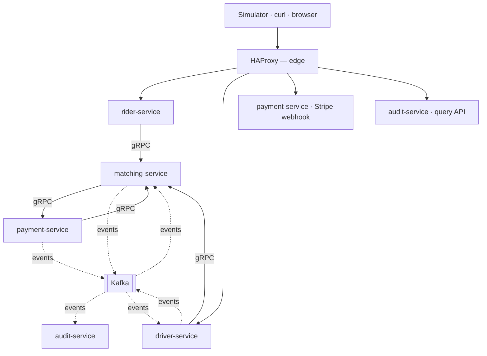
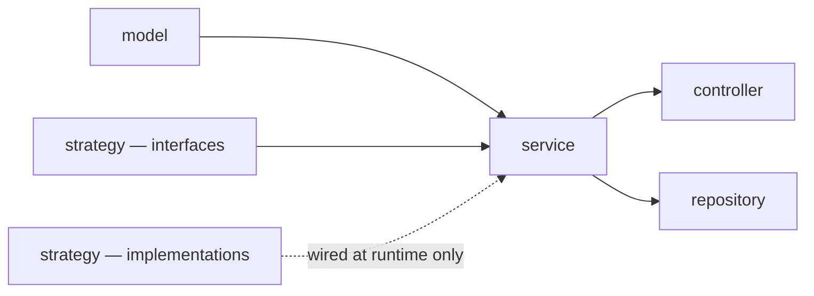
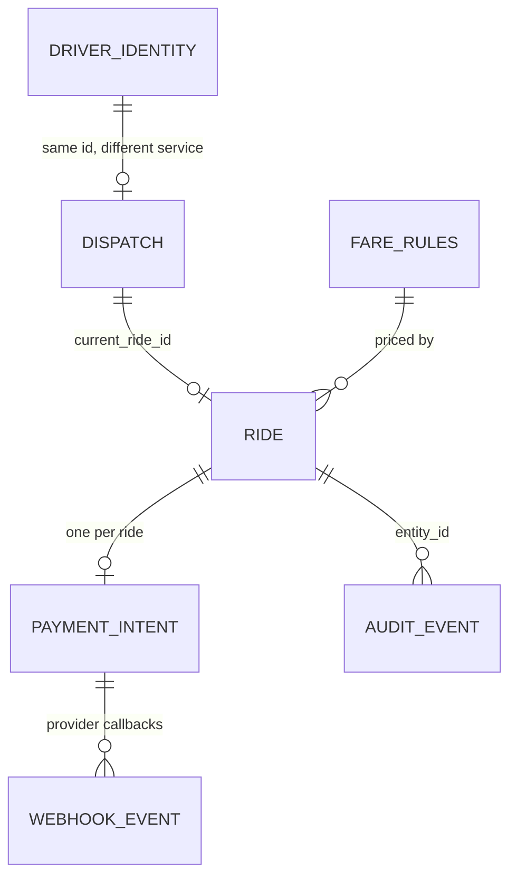
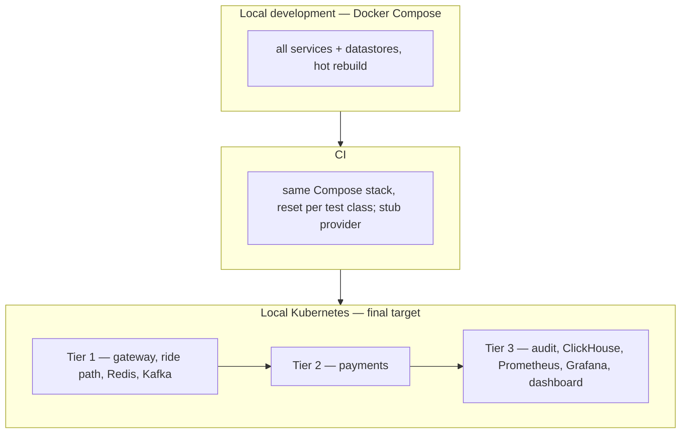

# Architecture Spine — Puber

## Design Paradigm

**Layered services with Strategy-swapped adapters, composed by an event backbone.**

Each service is internally layered — `controller` → `service` → `repository`, over an immutable
`model` — with a `strategy` package holding the implementations that vary over the project's
lifetime. Deliberately **not** hexagonal: the feature decomposition already happened at the
service boundary, so ports-and-adapters inside an already-feature-scoped service is ceremony.

The paradigm choice is driven by one observation: **Puber's roadmap is a sequence of five adapter
swaps** — HTTP→Kafka, Postgres→Redis for locations, Postgres→ClickHouse for analytics, stub→Stripe,
polling→WebSocket. Strategy interfaces exist at exactly those seams and nowhere else.

Between services, two transports with a strict division: **synchronous gRPC carries anything an
actor waits for a response to**; **Kafka carries propagation**. Kafka never replaces the
synchronous path, because the edge services own no data and must reach `matching-service` to get
a ride id, a rejection, or a read result.

## Invariants & Rules

### Dependency direction





---

### AD-1 — Database per service

- **Binds:** all services
- **Prevents:** any service reaching into another's tables because SQL made it possible
- **Rule:** each service owns a private Postgres database. No shared instance, no cross-database query, no foreign key spanning services. Two tables may share a name across services; they are unrelated.

### AD-2 — Co-written data shares one transactional owner

- **Binds:** all writes
- **Prevents:** a saga or compensating action anywhere in the core dispatch path
- **Rule:** if a single user-visible action writes two pieces of state, both live in one service's database and are written in one local transaction. Never coordinate a multi-step distributed transaction; if a design needs one, the boundary is wrong. This governs *synchronous co-writes*. Ride state and payment state are deliberately **separate machines advancing independently** (AD-41, AD-44) — neither waits on the other, and a late outcome is applied against current state rather than rolled back. That is not a distributed transaction and does not violate this rule.

### AD-3 — Service ownership

- **Binds:** all persistence
- **Prevents:** ride state and driver availability landing in different databases, which would force cross-service coordination on every dispatch
- **Rule:** `rider-service` owns nothing (stateless façade). `driver-service` owns driver identity and location only. `matching-service` owns `rides`, its own dispatch `drivers`, and `fare_rules`. `payment-service` owns `payment_intents` and `webhook_events`. `audit-service` owns `audit_events` and the ClickHouse tables. **Redis is owned solely by `matching-service`** — it is the only writer of both the geo set and the position keys, because membership requires dispatch status that only it holds; `driver-service` contributes positions by publishing events, never by writing Redis.

### AD-4 — Caches are advisory; the owning row is authoritative

- **Binds:** Redis geo set, Redis position keys, driver-identity snapshot
- **Prevents:** a stale cache read causing a double-booking rather than a retry
- **Rule:** a cache may only select candidates. Every state change is decided by a conditional `UPDATE` against the owning row; the loser re-searches. Never trust a cache for correctness.

### AD-5 — The gateway exposes edge services only

- **Binds:** HAProxy routing
- **Prevents:** `matching-service` becoming publicly reachable, which would make the façade layer optional and let clients bypass it
- **Rule:** the gateway routes only to `rider-service`, `driver-service`, the Stripe webhook, and audit's query API. `matching-service` is never publicly routable. Internal hops bypass the gateway entirely.

### AD-6 — Queue bounds form one chain, sized from the scarcest resource outward

- **Binds:** HAProxy, Tomcat, HikariCP, Resilience4j bulkheads, `event_outbox`
- **Prevents:** an edge bound that merely relocates the queue into a layer with no observability
- **Rule:** every queue in the request path has an explicit bound, and the tightest bound sits where there is visibility — HAProxy — so overflow sheds with a 503 rather than piling up inside the JVM. A bigger queue is not a fix; it converts a throughput problem into unbounded latency.

### AD-7 — Layered packaging with Strategy for varying behaviour

- **Binds:** all services
- **Prevents:** five independently built services inventing five internal structures
- **Rule:** `controller` / `service` / `repository` / `model` / `strategy` / `config`. The domain package is named `model`, never `entity` — the latter implies JPA, and there is no ORM.

### AD-8 — One-way dependency inside a service

- **Binds:** all services
- **Prevents:** a concrete adapter import silently un-swapping a Strategy and breaking the stub payment path
- **Rule:** `model` imports nothing framework-flavoured; `service` imports `model` and Strategy **interfaces**, never an implementation; `controller` imports `service`; nothing imports `controller`.

### AD-9 — `matching-service` alone splits by feature

- **Binds:** `matching-service`
- **Prevents:** cyclic packages, and the split being copied into single-domain services where it is ceremony
- **Rule:** packages `shared`, `fare`, `ride`, `dispatch`, `quote`, ordered one-way `shared ← fare ← ride ← dispatch ← quote`. The match transaction and the surge scheduler both live in `dispatch` precisely because it sits above `ride` and `fare`. Layer by default; split by feature only where a service holds more than one domain.

### AD-10 — Strategy interfaces only where implementations vary — never over Postgres

- **Binds:** `PaymentProvider`, `PaymentGateway`, `Clock`, `DriverLocationIndex`, `EventTransport`
- **Prevents:** tests passing against a fake repository that lacks the locking semantics NFR-1 depends on
- **Rule:** introduce an interface where a second implementation genuinely exists. Repositories take no interface: race-safety **is** Postgres's behaviour (row locks, partial unique indexes, conditional updates), so tests run against the **real datastores in the Compose stack** — never a fake, an in-memory substitute, or a different SQL dialect. See AD-56 for the isolation this obliges.

### AD-11 — State machines are explicit transition tables

- **Binds:** ride lifecycle, payment lifecycle
- **Prevents:** validity scattered across `if` checks, so a replayed event can advance state twice
- **Rule:** each machine is an enum plus an allowed-transitions map in `model`. Illegal transitions raise a domain exception. This is what makes NFR-4's replay-safety structural rather than remembered.

### AD-12 — All services carry the `-service` suffix

- **Binds:** service names, directories, Kubernetes resources
- **Prevents:** mixed `api` / `engine` / `service` naming implying three different kinds of component
- **Rule:** `rider-service`, `driver-service`, `matching-service`, `payment-service`, `audit-service`. Java packages stay suffix-free (`com.puber.rider`).

### AD-13 — Ride state machine

- **Binds:** FR-9–FR-19, FR-22–FR-24
- **Prevents:** `MATCHED` meaning both "offer outstanding" and "driver accepted", which leaves the offer-timeout sweep nothing to filter on
- **Rule:** `REQUESTED → WAITING_MATCH → OFFERED → MATCHED → IN_PROGRESS → COMPLETED`, plus terminals `CANCELLED`, `NO_DRIVER`, `PAYMENT_FAILED`. `REQUESTED` means *awaiting authorisation* and nothing else; it is entered exactly once and never returned to, so a ride holding funds can never fall back into re-authorising them. Recovery returns to `WAITING_MATCH`.

### AD-14 — One active ride per rider, enforced by a partial unique index

- **Binds:** FR-3
- **Prevents:** the check-then-insert race, with no rider row available to lock
- **Rule:** `CREATE UNIQUE INDEX ... ON rides (rider_id) WHERE status IN ('REQUESTED','WAITING_MATCH','OFFERED','MATCHED','IN_PROGRESS')`. A concurrent second request fails on the constraint and becomes a 409. The index holds only active rides, so it stays small regardless of total volume.

### AD-15 — Every transition is a guarded conditional update, with fixed lock ordering

- **Binds:** all ride and dispatch writes
- **Prevents:** lost updates, double-booked drivers, and deadlock between transactions touching both tables
- **Rule:** every write carries its expected prior state **and** the acting identity in the `WHERE` clause; zero rows affected means rejected, never silently retried as success. Any transaction touching both tables takes **`rides` first, then `drivers`**.

### AD-16 — `BUSY` spans the whole engagement

- **Binds:** dispatch status, FR-20
- **Prevents:** an `AVAILABLE` driver with an outstanding offer receiving a second one
- **Rule:** dispatch status is `OFFLINE | AVAILABLE | BUSY`; `BUSY` is set at **offer** time and cleared on release or completion, so `status = 'AVAILABLE'` is the *declared* half of matchability — the full test is AD-21's conjunction with a fresh heartbeat, and neither half alone is sufficient. Because `BUSY` spans offer and ride, the go-offline guard reads the **ride's** state, not the dispatch status: `OFFERED` releases and permits, `MATCHED`/`IN_PROGRESS` refuses.

### AD-17 — Declined and expired drivers are excluded from re-offer

- **Binds:** FR-11, FR-23
- **Prevents:** a declining driver — still nearest, back in the geo set — being re-offered the same ride until the `NO_DRIVER` window burns out
- **Rule:** the ride carries `declined_by UUID[]`; matching filters `NOT (driver_id = ANY(declined_by))`. Offer timeouts append to it as well as explicit declines. No separate offers table — the durable history is the audit trail.

### AD-18 — Provenance is a field, not a state

- **Binds:** FR-14, terminal ride states
- **Prevents:** every "completed rides" query having to match two values, where missing one silently drops auto-completed rides from a report or a capture
- **Rule:** an auto-completed ride ends in `COMPLETED` with `completed_by = DRIVER | SYSTEM`. Generalises: how a state was reached is a column, never a distinct state.

### AD-19 — Matching reads only `WAITING_MATCH`

- **Binds:** FR-9, FR-10
- **Prevents:** dispatching a ride whose funds are not yet held
- **Rule:** the matching query selects `status = 'WAITING_MATCH'` alone. An unfunded ride is therefore *invisible* to dispatch rather than rejected by a guard someone must remember to write.

### AD-20 — Matching runs as a claim-loop worker pool, the single offerer

- **Binds:** FR-10, FR-11, FR-23
- **Prevents:** two offer paths that must stay consistent, and an autoscaler that multiplies failing searches during a driver shortage
- **Rule:** a small fixed pool claims batches with `FOR UPDATE SKIP LOCKED`, processes, and re-claims; it waits only on an empty claim. Decline and timeout **release only** — offers are made in exactly one place. Pool size is derived from arrival rate × match time, never scaled on backlog depth: a `WAITING_MATCH` backlog usually signals missing supply, which more workers cannot fix.

### AD-21 — Declared status and observed reachability are separate facts

- **Binds:** FR-29
- **Prevents:** a tunnel ending a driver's shift and requiring manual recovery
- **Rule:** dispatch status is written only by the driver's own action, the ride lifecycle, or session expiry — **never** by loss of signal. Matchability is `AVAILABLE` **and** a fresh heartbeat. A returning driver becomes matchable on their next heartbeat with no transition.

### AD-22 — Session expiry ends a shift after prolonged absence

- **Binds:** FR-30
- **Prevents:** Monday's shift leaking into Wednesday, putting a driver online without their action and contradicting FR-20
- **Rule:** an **idle** driver unreachable for one hour is set `OFFLINE` with a `SYSTEM` audit event and must explicitly go online again. Applies only to drivers holding no ride, and the window must remain strictly longer than the `IN_PROGRESS` staleness window.

### AD-23 — Heartbeats are stamped at produce time

- **Binds:** FR-26, FR-29, all staleness windows
- **Prevents:** consumer lag masking staleness — a backed-up consumer makes every vanished driver look freshly heard, failing worst under load
- **Rule:** `driver-service` stamps the timestamp when producing; consumers never re-stamp on receipt. Staleness windows are sized to absorb clock skew plus plausible lag.

### AD-24 — Driver display identity is snapshotted onto the ride

- **Binds:** FR-6
- **Prevents:** a cross-service call on every rider poll for a value that never changes
- **Rule:** the driver's display identity is copied onto the ride at offer time and cleared on release. It travels to `matching-service` on the go-online call, so no extra fetch is needed. The snapshot is also more correct — it records who actually drove.

### AD-25 — Grid size is a scenario parameter

- **Binds:** FR-10, NFR-2
- **Prevents:** a 5 km matching radius exceeding the whole grid, so it filters nothing and nearest-driver degenerates into sorting every available driver
- **Rule:** geographic bounds are configuration, not a constant — a small square at fixture scale, roughly 20 km across at stress scale so driver density stays realistic and the radius does real work. Fixture coordinates are generated relative to the configured bounds.

### AD-26 — Redis holds the matchable geo index and every driver's position

- **Binds:** FR-26, FR-28, FR-6
- **Prevents:** over-fetching ineligible candidates when most drivers are busy, and losing the position of a driver who is on a ride
- **Rule:** two structures with deliberately different populations — a geo set containing **matchable drivers only**, searched with `GEOSEARCH`; and a per-driver position key covering **every** driver, TTL'd longer than the longest staleness window, serving point lookups and all staleness comparisons. Two writes per heartbeat, pipelined, and **zero Postgres writes**. Stale geo members are removed lazily on encounter. **Absence is never evidence of staleness:** a sweep may act only on a recorded timestamp older than its window, never on a missing key. Redis holds no persistence (AD-27), so after a restart every key is absent while the drivers behind them are perfectly healthy — treating that as staleness would auto-complete and capture every in-flight ride at once.

### AD-27 — Redis is a cache, configured as one

- **Binds:** Redis deployment
- **Prevents:** clustering a single hot key, and paying fsync latency on the system's hottest path
- **Rule:** one instance, no cluster (the geo set is a single key, so sharding by key cannot help), no persistence (every value rebuilds within one heartbeat cycle), `noeviction` with generous headroom. Read replicas are the first scaling lever and are safe because the geo set is advisory. Redis is never a source of truth.

### AD-28 — Domain events are published through a transactional outbox

- **Binds:** all domain events
- **Prevents:** the dual-write split — committed state with a lost event, or an event with no state — and any interface pretending a synchronous call and an async publish are the same thing
- **Rule:** domain code never publishes; it writes an `event_outbox` row in the same local transaction as the state change, and a relay ships it. **Heartbeats never use the outbox** — location pings are ephemeral telemetry, not state transitions, and would put the hot-row write pattern back into Postgres.

### AD-29 — Outbox rows are claimed and deleted, never tracked by a cursor

- **Binds:** `event_outbox`, the relay
- **Prevents:** timestamp ordering, which a backwards clock or replica skew can invert — and, more dangerously, a high-water-mark relay that loses events permanently
- **Rule:** the primary key is a `GENERATED ALWAYS AS IDENTITY` bigint, assigned from one authority rather than from a replica's clock. **Assignment is ordered; commit visibility is not** — a transaction holding a lower id can commit after one holding a higher id. A relay that remembered a cursor (`WHERE id > lastSeen`) would therefore skip the late-committing row **forever**, reintroducing exactly the dual-write loss AD-28 exists to prevent. The relay must therefore **claim and delete**, never advance a watermark: rows are selected by claimability, locked with `SKIP LOCKED`, and removed on success, so a late arrival is simply picked up on the next pass. `occurred_at` records when the event happened and is never used for ordering.

### AD-30 — The payload is the built event, as JSON

- **Binds:** all event payloads
- **Prevents:** an event describing state as of publish time rather than transition time, and a serialised object that only one language can read
- **Rule:** the fully-formed event is serialised at transaction time. Never store the entity to be rendered later — the relay runs seconds afterwards, by which point the ride may have moved on. Never native language serialisation: consumers are independently built with duplicated domain code, so a serialised Java object would force the shared library the project rejects.

### AD-31 — Envelope carries routing; body carries meaning

- **Binds:** event envelope, `event_outbox` columns
- **Prevents:** the relay parsing payloads, and therefore needing per-event-type domain knowledge
- **Rule:** anything infrastructure or a cross-cutting consumer must read for every event type is promoted to an envelope column — `event_id`, `event_type`, `entity_type`, `entity_id`, `actor_type`, `actor_id`, `schema_version`, `occurred_at`, and `correlation_id`. `entity_type`/`entity_id` deliberately match `audit_events`, so one vocabulary spans both tables. `correlation_id` carries the gateway's identifier into the asynchronous world, so a trace does not end where the request does.

### AD-32 — Events are fat, bounded to a deliberate contract

- **Binds:** all event payloads
- **Prevents:** consumers calling back per event — a callback storm that also records state as of the callback rather than the transition
- **Rule:** an event carries what its consumers need inline. It is a contract, not a row dump: include what is genuinely consumed and nothing more, because every extra field becomes one that can never be removed.

### AD-33 — Contracts evolve by addition only

- **Binds:** event payloads, gRPC `.proto` definitions
- **Prevents:** a mutated live contract silently breaking every existing consumer
- **Rule:** adding a field is safe; removing, renaming, retyping, or **changing what a field means** is breaking and requires a new `event_type` or message alongside the old one. Protobuf field numbers are never reused. Consumers must ignore unknown fields — note a hand-built Jackson `ObjectMapper` fails on them by default, which is exactly where Kafka consumer configs build their own.

### AD-34 — Outbox retries are per row, with the breaker checked before claiming

- **Binds:** the outbox relay
- **Prevents:** one poison event rolling back its batch and stalling the stream forever; and a brief outage burning every event's retry budget and mass-dead-lettering the outbox
- **Rule:** success deletes the row, failure increments `tries` and pushes `next_attempt_at` out by exponential backoff, and the batch commits once so successes persist regardless of neighbours. At the cap, `dead_at` is stamped and the row stops being claimed. **The circuit breaker is evaluated before touching the database**, so rows that were never fetched cannot have their `tries` incremented; probe with a small batch while half-open.

### AD-35 — The outbox is a bounded queue that sheds on backlog age

- **Binds:** `event_outbox`, ride creation
- **Prevents:** an unbounded queue silently accumulating unpublished truth while the backbone is down
- **Rule:** past the bound, new ride requests are shed with a 503 rather than accepting work the system cannot record. The trigger is backlog **age**, not depth — a large backlog draining healthily is fine; a small one that has not moved is broken. **The age metric counts only claimable rows (`dead_at IS NULL`).** Dead rows remain in the table by design (AD-34), so including them would let a single poison event age the backlog forever and shed *every* ride request permanently — turning one bad message into a total outage. Dead rows are tracked by their own gauge, which alerts rather than sheds. The bound is derived as arrival rate × the outage duration to ride out, and drain rate must exceed arrival rate with headroom.

### AD-36 — Kafka producers key by entity; consumers are idempotent

- **Binds:** all topics and consumers
- **Prevents:** one entity's events processed out of order across partitions, and a redelivery advancing state twice
- **Rule:** every producer sets the partition key to the entity id. Every consumer is idempotent, deduplicating on `event_id` — a system-wide rule, not a payments concern. New consumer groups start at `earliest`. Where a consumer's write is a guarded transition, the guard supplies idempotency for free.

### AD-37 — REST at the edge, gRPC between services

- **Binds:** all inter-service calls, all public endpoints
- **Prevents:** a mixed transport story, and the assumption that Kafka removes the synchronous path
- **Rule:** everything through the gateway is REST — curl, a browser and the Simulator are first-class clients. Every internal synchronous hop is gRPC; the edge services are protocol translators. Kafka carries propagation only: anything an actor waits on a response for stays synchronous, because the façades own no data.

### AD-38 — One error vocabulary, mapped at the façade

- **Binds:** all endpoints, all gRPC services
- **Prevents:** five services answering "the guarded update affected zero rows" five different ways, and a 403 confirming a resource exists
- **Rule:** public errors are RFC 9457 Problem Details carrying the gateway's correlation id. Mapping: wrong state → `FAILED_PRECONDITION` → 409; one-active-ride → `ALREADY_EXISTS` → 409; identity mismatch or absent → `NOT_FOUND` → **404, never 403**; lost race → `ABORTED` → retried internally and never surfaced; malformed → `INVALID_ARGUMENT` → 400; shed → `UNAVAILABLE` → 503. Two rows deviate from gRPC's canonical HTTP mapping deliberately: `FAILED_PRECONDITION` and `ALREADY_EXISTS` both surface as 409 rather than 400/409 respectively, because to a rider they are the same event — the request conflicts with the ride's current state. The house mapping wins over the canonical one; it is written here so the deviation is a decision rather than a bug.

### AD-39 — Rider-scoped resources hang off the ride, and internal ids stay internal

- **Binds:** rider-facing endpoints
- **Prevents:** driver identifiers appearing in rider-facing URLs, giving something to enumerate before any check runs
- **Rule:** rider-scoped data is addressed as a sub-resource of the ride, never of the other actor. Responses carry the driver's name, not their identifier. This is correct shape rather than a security boundary — identity is trusted as-is under FR-48.

### AD-40 — Ride reads are split by volatility

- **Binds:** FR-5, FR-6
- **Prevents:** one fast-changing field making the entire resource uncacheable
- **Rule:** ride detail (slow-changing: status, assigned driver) is a separate endpoint from live driver position (changing every heartbeat). Detail uses `ETag` / `If-None-Match` and answers 304 on the common path; position returns coordinates **and** ETA from one Redis read. The two may be polled at different rates.

### AD-41 — No driver is dispatched until funds are held, asynchronously

- **Binds:** FR-9, FR-34
- **Prevents:** ride creation blocking on the payment provider, and the provider sitting in the path of every request at stress scale
- **Rule:** the ride is persisted as `REQUESTED` and its id returned immediately; authorisation proceeds asynchronously and moves the ride to `WAITING_MATCH` or `PAYMENT_FAILED`. The handler applying that outcome does exactly one guarded transition, which makes it idempotent without a dedupe table.

### AD-42 — Payment tokens are typed and transit-only

- **Binds:** FR-2, NFR-10
- **Prevents:** a token escaping into a log line, a stack trace, or a serialised response by accident
- **Rule:** the token is a dedicated value type whose `toString()` is masked, never a bare string; it is never persisted, never echoed, and passes through to `payment-service` as the only component that talks to the provider. Redaction is an application concern — the gateway cannot see body fields.

### AD-43 — Two payment strategies, at two layers

- **Binds:** `matching-service`, `payment-service`, NFR-8
- **Prevents:** conflating "there is no payment service yet" with "there is no provider", which are different problems at different layers
- **Rule:** `matching-service` holds an outbound gateway strategy — call `payment-service`, or signal authorised immediately. `payment-service` separately holds a provider strategy — real provider, or stub for the stress test and CI. The stress exclusion swaps the **provider**, keeping the whole payment state machine in the flow, rather than skipping the path and exercising code that does not exist in production. **The immediate-authorise gateway is confined to phases before `payment-service` exists, and to CI.** It is explicitly **not** a runtime degradation for a payment-service outage: auto-authorising while payments are merely *unavailable* would dispatch rides against funds nobody holds and capture against intents that were never created, breaking FR-9. When payments exist but are down, rides stall (AD-48).

### AD-44 — A terminal ride never leaves an outstanding authorisation

- **Binds:** FR-16, FR-36, FR-40
- **Prevents:** a hold stranded against a dead ride when cancellation lands while authorisation is still in flight
- **Rule:** a terminal event arriving before the authorisation resolves records the intent (`void_requested`) rather than no-opping; the authorisation result then voids on arrival instead of settling. **No automatic voiding sweep** — an authorisation that merely looks stale may belong to a long live trip, and voiding it would leave a completed ride with nothing to capture. The invariant is asserted in tests and monitored by an alert.

### AD-45 — Bound outcomes the system can determine; never bound a wait for external truth

- **Binds:** FR-9, FR-12
- **Prevents:** a timeout that frees a rider to request again while their first hold is still outstanding — doubling holds across every stuck rider at once, against a rate-limited provider, exactly when the system is least able to cope
- **Rule:** `NO_DRIVER` is bounded, because "we looked and found nobody" is an answer the system holds. A ride awaiting authorisation is **not** bounded by a timeout; it is surfaced as a metric and an alert, and the rider's own cancellation is the exit. A stuck ride also blocks that rider from requesting another, which throttles load naturally during an outage.

### AD-46 — Time constants are one tuned set with fixed ordering

- **Binds:** FR-11, FR-12, FR-13, FR-14, FR-21, FR-26, FR-29, FR-30
- **Prevents:** independently chosen intervals that interact badly — a poll slower than the offer window, or a staleness window shorter than plausible clock skew
- **Rule:** heartbeat 2 s; driver poll 2 s (one client timer serves both); offer timeout 10 s; worker idle backoff 500 ms; `NO_DRIVER` budget 60 s; idle staleness 15 s; `MATCHED` staleness 90 s; `IN_PROGRESS` staleness 10 min; session expiry 1 h. **The `NO_DRIVER` budget is accumulated time spent in `WAITING_MATCH` only** — it does not run while a ride is `OFFERED` or `MATCHED`. Measured as wall time since request it would be shorter than the 90 s `MATCHED` staleness window, so a ride salvaged from a silent driver (FR-13) would be killed as `NO_DRIVER` on the very next sweep, making the salvage path unreachable in every case rather than occasionally. The **ordering is the invariant** and must survive any retuning: `poll ≪ offer timeout`; `idle < MATCHED < IN_PROGRESS < session expiry`; every staleness window comfortably exceeds clock skew plus lag; and no seeking budget is consumed by time spent not seeking.

### AD-47 — Capacity is derived, not guessed

- **Binds:** connection pools, thread pools, worker pools, replica counts, partition counts
- **Prevents:** oversized pools that relocate queueing into Postgres, where it is invisible and each connection costs real memory
- **Rule:** size every pool as arrival rate × service time. The result is usually smaller than instinct suggests — ride writes need single-digit database concurrency, and the read path barely touches Postgres at all because detail reads answer 304 and position reads are Redis-only. Concrete values are set from measurement under the NFR-2 stress run.

### AD-48 — A component may be turned off exactly when it sits behind an event boundary

- **Binds:** deployment, NFR-2, NFR-7
- **Prevents:** discovering under resource pressure which components are load-bearing
- **Rule:** Tier 1 — gateway, the three ride-path services and their stores, Redis, Kafka — is required. Tier 2 — `payment-service` — degrades to rides stalling before dispatch. Tier 3 — `audit-service`, ClickHouse, Prometheus, Grafana, the live dashboard — may be disabled with nothing breaking, and loses no data because consumer offsets survive and the backlog drains on return. Anything on the synchronous request path is not optional.

### AD-49 — Deployment is declarative and reconciled from git

- **Binds:** FR-47, NFR-7
- **Prevents:** cluster state drifting from the repository with no signal
- **Rule:** manifests live in the repository and a GitOps controller reconciles the cluster to them; rollback is a revert. Services are generated from one template rather than copied per service; infrastructure is declared individually; sync ordering ensures datastores are healthy before dependants. Provider secrets are the one documented exception, created out-of-band and excluded from reconciliation, because NFR-10 forbids keys in source.

### AD-50 — Payment state machine

- **Binds:** FR-7, FR-35–FR-40
- **Prevents:** four services reading payment outcomes with four different vocabularies — the same divergence AD-13 closes for rides, on a machine that crosses just as many boundaries and is rider-visible
- **Rule:** `INITIATED → AUTHORIZED → CAPTURED → REFUNDED`, plus `FAILED` (declined at authorisation, or capture retries exhausted) and `VOIDED` (hold released without capture). Transitions are an explicit table per AD-11; illegal ones raise rather than no-op, which is what makes a replayed provider webhook safe. Exactly one payment per ride. `FAILED` distinguishes its cause in a field, not in a second state (AD-18).

### AD-51 — Real-time push is a third transport, fanned out and filtered locally

- **Binds:** FR-45, FR-50
- **Prevents:** an event reaching a service replica that does not hold the target driver's socket, so the offer is silently dropped — and the assumption that AD-37's two transports cover every case
- **Rule:** WebSocket is a third transport, admitted only for **server-initiated push to a connected client** — never for request/response, which stays REST at the edge and gRPC internally. Sockets are held by `driver-service` (driver offers and ride-state changes) and by the dashboard consumer (FR-50). Routing is **fan-out-and-filter**: every replica consumes the relevant topic in its **own consumer group** and pushes only to sockets it currently holds, so no replica registry, sticky routing, or shared session store is required. A driver connected to no replica simply receives nothing and recovers on their next state read — push is an accelerator over the polling path, never the only delivery route for anything correctness-bearing.

### AD-52 — Cross-service contracts have one source and are copied mechanically

- **Binds:** protobuf definitions, event schemas
- **Prevents:** "field numbers are never reused" being unenforceable because every service holds an independently edited copy with no arbiter
- **Rule:** `.proto` files and event schemas live in one versioned directory in the repository and are **copied into each service at build time**, never hand-edited per service. Duplication into build outputs is mechanical; duplication of the *source* is forbidden. This satisfies the no-shared-library constraint — services still build independently, with no runtime or compile dependency between them — while giving AD-33's additive-only rule a single place where it can actually be checked.

### AD-53 — Audit retention and the columnar mirror

- **Binds:** NFR-6, FR-42, FR-43, FR-44
- **Prevents:** an unbounded audit table, and two different answers to "which store answers this question"
- **Rule:** `audit_events` in Postgres is **partitioned by month and pruned by dropping partitions**, never by row-level `DELETE`, so retention is a metadata operation rather than a churn of dead tuples. The columnar store holds the full history and is fed from the same Kafka topics by an independent consumer group — a **parallel consumer, never a Postgres-to-columnar copy job**, so neither store is derived from the other and either can be rebuilt from the log. Point lookups by entity or actor are served from Postgres; aggregate analytics are served from the columnar store. The retention window is configuration, not a constant.

### AD-54 — Every service is observable the same way from day one

- **Binds:** NFR-5, FR-46
- **Prevents:** five services instrumented differently, so no dashboard can compare them and no trace survives a hop
- **Rule:** every service exposes health and Prometheus metrics from its first commit, not retrofitted. The gateway mints a correlation id on every inbound request; it is propagated across gRPC metadata, carried in the event envelope (AD-31), and included in every log line and error response. Every queue, pool, and backlog named in AD-6, AD-34 and AD-35 exposes depth and age as gauges — an unmeasured bound cannot be tuned, and the NFR-2 stress run exists to read exactly these.

### AD-55 — Consumer-side failure is bounded and visible

- **Binds:** NFR-3, FR-32, FR-33
- **Prevents:** a poison message blocking a partition forever, or being silently dropped — the consumer-side twin of AD-34, which only governs the producer
- **Rule:** a consumer that cannot process a message retries with **jittered** backoff (never synchronised, or every replica retries in lockstep and hammers the dependency in waves), and on exhaustion routes the message to a dead-letter topic rather than blocking its partition or discarding it. Dead-lettered volume is a metric that alerts and is zero in health. Because delivery is at-least-once, a retry must be safe by AD-36's idempotency rule rather than by hoping the failure was clean.

### AD-56 — Tests run against the real stack, reset between test classes

- **Binds:** NFR-1, NFR-9, all integration tests
- **Prevents:** cross-test interference from fixture-seeded drivers producing flaky concurrency tests — the worst possible failure here, because a flake is **indistinguishable from a real race**, so the one suite whose job is to prove no driver is ever double-booked becomes the one people learn to re-run and ignore
- **Rule:** integration tests run against the same Compose stack used to run the application — real Postgres, Redis and Kafka, joined over the Compose network. The test runner is itself a container, so it never needs a Docker socket of its own; a library that starts its own containers would fight the no-host-JDK constraint rather than serve it. Every test class **truncates and reseeds** before running: riders use fresh identifiers and rarely collide, but drivers are seeded with fixed, known ones, so two tests driving the same driver through a state machine will otherwise interfere. Consequences accepted deliberately: tests run **sequentially** against one shared database, and the Simulator's reproducibility (NFR-9) requires the same clean slate, so a seeded run always begins from a reset stack.

### AD-57 — SOLID is the design vocabulary, and is made testable rather than cited

- **Binds:** internal design of every service
- **Prevents:** SOLID being invoked in review as an unfalsifiable preference — and two specific divergences the other rules do not catch
- **Rule:** SOLID governs internal design, and most of it is already binding in concrete form: Single Responsibility through AD-3 and AD-9, Open/Closed through AD-10, Dependency Inversion through AD-8. Where a principle is cited in review it must be reduced to one of those rules or to a named failure; "this violates SRP" is not by itself a finding. Two principles carry their own weight here and are stated as rules in their own right. **Liskov:** a Strategy implementation must be substitutable with no caller branching on which one is active — no inspecting the concrete type, and no behaviour a caller must special-case. The stub payment provider in particular must deliver its outcome through **the same channel** as the real one, merely faster; a stub that resolves synchronously where the provider resolves asynchronously means the stress run never exercises the asynchronous path, and AD-43's "swap the provider, keep the path" silently becomes "test different code". **Interface Segregation:** gRPC contracts are segregated by *consumer*, not by owner — no single service definition carrying both rider-facing and driver-facing methods, or a driver-side change forces a rider rebuild and creates a dependency nobody chose.

## Consistency Conventions

| Concern | Convention |
| --- | --- |
| Service naming | `<role>-service`, lowercase, hyphenated. Java packages `com.puber.<role>`, suffix-free. |
| Table naming | Plural, snake_case. A name may repeat across services; it is a different table. |
| Event naming | `<entity>.<past-tense-action>`, lowercase — `ride.matched`, `payment.captured`. The prefix always matches `entity_type`. |
| Identifiers | UUID for domain entities; monotonic bigint identity only for internal ordering, never exposed. |
| Timestamps | `TIMESTAMPTZ`, UTC. Wall-clock for recorded facts, monotonic for deadlines and durations within a process. |
| Money | Integer minor units in transit; `DECIMAL` at rest. Never floating point. |
| Coordinates | `DECIMAL(10,8)` / `DECIMAL(11,8)`, WGS84, longitude before latitude in geo calls. |
| Schema evolution | Expand-only. Additive, nullable, no backfill in the same migration; the same discipline governs events and protobuf. |
| SQL | Explicit SQL via `JdbcTemplate`. No ORM. Immutable records as the domain model. |
| Transactions | `READ COMMITTED`. Correctness comes from guarded conditional updates and unique indexes, not from a stricter isolation level. |
| Errors | RFC 9457 at the edge, gRPC status codes internally, mapped at the façade. Identity mismatch is always 404. |
| Logging | Structured, one correlation id from the gateway through every hop. Payment tokens and provider keys never logged. |
| Configuration | Environment variables; secrets never in source, fixtures, or manifests. |
| Testing | Real Postgres, Redis and Kafka from the Compose stack; truncate and reseed per test class; sequential. Seeded, reproducible Simulator runs from a reset stack. Time advanced through the clock abstraction, never by sleeping. |

## Stack

| Name | Version |
| --- | --- |
| Java (Temurin) | 25 |
| Spring Boot | 4.1.x |
| Spring gRPC | 1.1.0 (managed by Boot) |
| Gradle Wrapper | per service, 9.x |
| PostgreSQL | 18.6 |
| Flyway | 12.4.x (managed by Boot) |
| Apache Kafka (KRaft) | 4.3.1 |
| Redis | 8.x |
| ClickHouse | 26.3 LTS |
| HAProxy | 3.2.x LTS |
| Prometheus | 3.x |
| Grafana | 13.x |
| Resilience4j | 2.4.0 (`resilience4j-spring-boot4`) |
| Stripe Java SDK | 33.3.x |
| Docker Compose | v2 (spec 3.9) |
| Kubernetes (local, kind) | 1.35.x |
| Argo CD | 3.5.x |

Versions verified against upstream release data at authoring, not asserted from memory. Three
rows carry a hard constraint rather than a preference: **Resilience4j must be 2.4.0** — it is the
only release publishing a `spring-boot4` module, and earlier versions ship Boot 2/3 artifacts that
will not resolve; **Flyway must track Boot's managed version**, because overriding the BOM invites
a resolution conflict for no gain. Once the code exists it owns this table; it is cold-start seed,
not a register to maintain.

## Structural Seed

### Core entities and where they live



`DRIVER_IDENTITY` belongs to `driver-service`; `DISPATCH`, `RIDE` and `FARE_RULES` to
`matching-service`; `PAYMENT_INTENT` and `WEBHOOK_EVENT` to `payment-service`; `AUDIT_EVENT` to
`audit-service`. The relationships crossing those boundaries are *conventional*, carried by
shared identifiers — there is no foreign key between services.

### Source tree

```text
puber/
  infra/                      docker-compose for local development
  deploy/                     Kubernetes manifests, reconciled by GitOps
  docs/
  services/
    rider-service/            façade; owns no database
    driver-service/           driver identity and location
    matching-service/         rides, dispatch, fares — the only ride mutator
    payment-service/          provider integration; arrives with the payments phase
    audit-service/            event capture and analytics; arrives with the audit phase
    simulator/                synthetic load; plain Java, not Spring Boot
```

Each service directory is independently buildable — its own wrapper, its own build file, no
root build. Duplicated domain code across services is accepted; a shared library is not.

### Deployment and environments



There is no cloud environment at any point (NFR-7). The local Kubernetes cluster is the final
deployment target, and the tiering above is what makes it possible to run a reduced stack when
resources are constrained.

## Capability → Architecture Map

| Capability | Lives in | Governed by |
| --- | --- | --- |
| Quote, request, cancel, rider reads (FR-1–FR-8) | `rider-service` → `matching-service` `quote` / `ride` | AD-3, AD-14, AD-39, AD-40 |
| Authorisation gate (FR-9) | `matching-service` `ride` ← `payment-service` | AD-41, AD-19, AD-45 |
| Matching, offers, recovery (FR-10–FR-14) | `matching-service` `dispatch` | AD-15, AD-17, AD-19, AD-20, AD-26 |
| Ride state machine (FR-15–FR-17) | `matching-service` `ride` `model` | AD-11, AD-13, AD-15 |
| Rider-visible payment outcome (FR-7) | `payment-service` → `rider-service` | AD-50, AD-18 |
| Fares and surge (FR-18, FR-19) | `matching-service` `fare` | AD-9, AD-25 |
| Driver session and actions (FR-20–FR-25) | `driver-service` → `matching-service` `dispatch` | AD-16, AD-21, AD-24, AD-38 |
| Location, reachability, session expiry (FR-26–FR-30) | `driver-service` → Redis via Kafka | AD-21, AD-22, AD-23, AD-26, AD-27 |
| Event backbone and resilience (FR-31–FR-33) | outbox + relay in every producer | AD-28, AD-34, AD-35, AD-36, AD-55 |
| Payments (FR-34–FR-40) | `payment-service` | AD-41, AD-42, AD-43, AD-44, AD-50 |
| Audit and analytics (FR-41–FR-44) | `audit-service`, columnar store | AD-31, AD-36, AD-53 |
| Retention and partitioning (NFR-6) | `audit-service` | AD-53 |
| Real-time push (FR-45) | `driver-service` sockets | AD-51 |
| Health, metrics, dashboards (FR-46, NFR-5) | every service | AD-54 |
| Deployment to local Kubernetes (FR-47, NFR-7) | `deploy/`, GitOps controller | AD-48, AD-49 |
| Identity and simulation (FR-48, FR-49) | header identity, `simulator` | AD-39, AD-43 |
| Live operational dashboard (FR-50) | dashboard consumer | AD-51, AD-48 |

## Deferred

- **Concrete capacity values** — pool sizes, replica and partition counts, outbox bound, backoff base and retry cap. The derivation method is fixed (AD-47, AD-35); the numbers come from measurement under the NFR-2 stress run, and guessing them now would be fiction.
- **Per-cell geo partitioning** — kept available as the last scaling lever if a single geo key saturates, but it only pays when cells are substantially larger than the search radius, and nothing before it has been exhausted.
- **Eager staleness sweep** — lazy removal on encounter is sufficient until lingering geo ghosts are shown to matter.
- **Change-data-capture for the outbox** — polling teaches the pattern; a log-based relay is a later upgrade with its own infrastructure cost.
- **Schema registry** — additive-only evolution plus protobuf field numbering carries the contract discipline without another service to run.
- **Automated image promotion** — manual tag bumps at milestone cadence; automation solves a deploy frequency this project does not have.
- **Encrypted secrets in git** — sandbox credentials are created out-of-band and documented as outside reconciliation; sealed secrets are what real credentials would require.
- **Rider push channel** — polling is adequate because position changes only on heartbeat; a second channel becomes cheap once the driver and dashboard channels exist.
- **Per-cell surge** — surge is computed globally; geographic granularity needs a cell scheme with no stated requirement behind it.
- **Partial refunds, rider accounts, debtor standing** — product scope held by the PRD, foreclosed by nothing here.
