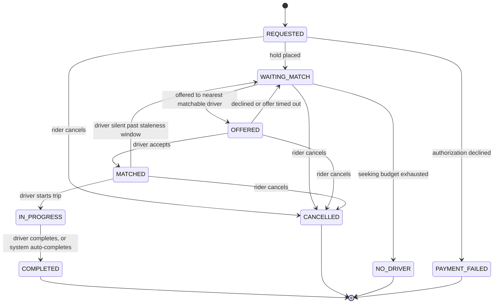
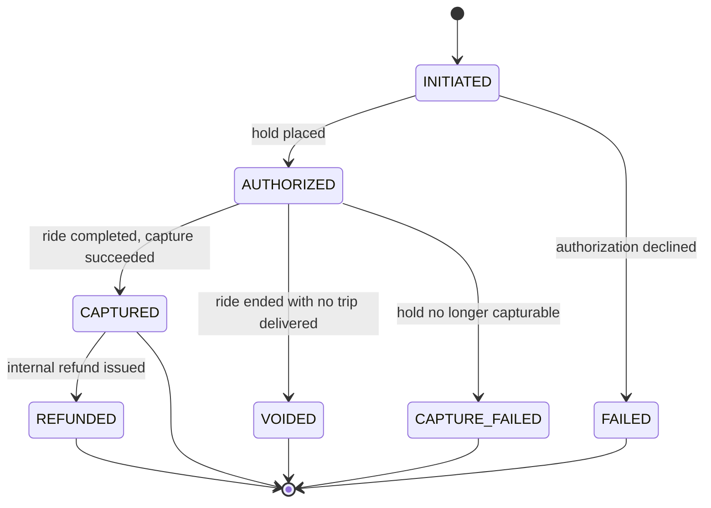

# State Machines — Puber

Companion to `SPEC.md`. Two machines govern the system: the ride lifecycle and the payment lifecycle. They advance **independently** — neither waits on the other, and a late outcome is applied against current state rather than rolled back (AD-2, AD-41, AD-44). Each is an explicit transition table in code; illegal transitions raise rather than no-op, which is what makes replay safe (AD-11).

## Ride lifecycle (FR-15, AD-13)

Terminal states: `COMPLETED`, `CANCELLED`, `NO_DRIVER`, `PAYMENT_FAILED`.

**Rules that the diagram alone does not carry:**

- **`REQUESTED` means *awaiting authorization*, nothing else.** It is entered exactly once and never returned to, so a ride already holding funds can never fall back into a state that would authorize them a second time.
- **Every recovery path lands in `WAITING_MATCH`** — a declined or expired offer, and a driver going silent before pickup. Never `REQUESTED`.
- **`OFFERED` ≠ `MATCHED`.** `OFFERED` means a specific driver is deciding; `MATCHED` means one has accepted and is en route. Collapsing them leaves the offer-timeout sweep nothing to filter on.
- **Matching reads `WAITING_MATCH` alone** (AD-19), so an unfunded ride is invisible to dispatch rather than rejected by a guard.
- **Cancellation is available from every pre-trip state** and always releases the driver, withdraws any outstanding offer, and voids any hold — including one that resolves after the ride is already terminal.
- **How a state was reached is a column, never a state** (AD-18): an auto-completed ride is `COMPLETED` with `completed_by = SYSTEM`, so a "completed rides" query cannot silently drop it.
- **The `NO_DRIVER` budget accumulates time in `WAITING_MATCH` only** — not time spent `OFFERED` or `MATCHED`. Measured as wall time since request it would be shorter than the `MATCHED` staleness window, making the silent-driver salvage path unreachable in every case (AD-46).
- Every transition is a guarded conditional update carrying its expected prior state and the acting identity; zero rows affected means rejected, never retried as success (AD-15).

## Payment lifecycle (FR-35, AD-50)

**Rules:**

- Exactly **one payment per ride**.
- **`CAPTURED` means the money moved.** The payment stays `AUTHORIZED` for the whole capture attempt including every retry, so a capture that cannot settle fails *from* `AUTHORIZED` — `CAPTURED` is never left except by a deliberate refund, and never by a failure.
- **Capture is pursued until it settles, not until a retry budget runs out.** A failing capture is retried with jittered backoff and keeps the payment in `AUTHORIZED`; retrying survives process restarts, because a valid hold on a delivered trip is money owed and abandoning it is a decision no cap should make silently. This is AD-45 applied to the capture path: the provider will eventually answer, so the wait for that answer is not bounded.
- **`CAPTURE_FAILED` is reached only when the hold is provably no longer capturable** — the provider reports it expired, was revoked, or was cancelled. That is an outcome the system holds, not a guess, so it is terminal.
- **`FAILED` and `CAPTURE_FAILED` are separate states because they differ in kind, not in provenance.** `FAILED` is an authorization declined before any trip — nobody was charged and nothing was lost. `CAPTURE_FAILED` is a delivered trip whose money is gone. AD-18 would fold a cause into a field; it does not apply here, because these two have different consequences, different consumers, and only one of them is revenue loss.
- **`CAPTURE_FAILED` is counted and its amount summed as a loss metric** that alerts and is zero in health — alongside the age of the oldest capture still retrying, which is the leading indicator (CAP-36). By the time a payment is `CAPTURE_FAILED` the money is already unrecoverable.
- Do not confuse the ride machine's `PAYMENT_FAILED` with the payment machine's `CAPTURE_FAILED`: the first is a ride that never happened because authorization was declined, the second is a ride that happened and was never paid for.
- `VOIDED` is a hold released without capture, reached from `CANCELLED` and `NO_DRIVER` rides.
- **A terminal ride never leaves an outstanding authorization.** A terminal event arriving while authorization is still in flight records the intent (`void_requested`) rather than no-opping; the authorization result then voids on arrival instead of settling (AD-44).
- **No automatic voiding sweep.** A hold that looks stranded may belong to a genuinely long live trip; voiding it would leave a completed ride with nothing to capture. The invariant is asserted in tests and watched by an alert (CAP-30).
- A replayed provider webhook is safe because the illegal transition raises rather than silently reapplying.

## Cross-machine coupling

Three couplings run ride → payment, and exactly one runs the other way:

| Ride event | Payment consequence |
| --- | --- |
| Ride requested | Authorization initiated; ride waits in `REQUESTED` for the outcome (CAP-7) |
| Ride `COMPLETED` (by driver or by system) | Capture |
| Ride `CANCELLED` or `NO_DRIVER` | Void |

| Payment state | Ride consequence |
| --- | --- |
| Rider's most recent ride is `COMPLETED` with its payment still `AUTHORIZED` | That rider's next ride request is refused, until it settles or the session-expiry bound lapses |
| Rider has a payment that reached `CAPTURE_FAILED` less than 30 minutes ago | That rider's next ride request is refused, until the window lapses |

**Once the hold is confirmed, the ride stops caring about payment.** From `WAITING_MATCH` onward nothing in the ride lifecycle waits on, blocks on, or rolls back for the payment machine — a late payment outcome is applied against current state, never compensated (AD-2, AD-41). The one reverse coupling above is deliberately placed at *request admission* rather than inside the lifecycle, so it costs nothing on any path a rider is already waiting on.

Two consequences worth stating plainly, because both are the design working rather than failing:

- **A provider outage throttles the system, but never stops it.** Captures stack up unsettled, so riders who completed a trip are refused their next one — the same natural admission control AD-45 relies on for a stuck authorization, load throttling itself against the struggling dependency. It is bounded at session expiry precisely so it stays throttling: because capture pursuit is uncapped, an unbounded block would refuse every such rider for the whole outage, which is total stoppage wearing admission control's clothes. Past the bound the rider rides again, and if that capture fails too, the `CAPTURE_FAILED` cooldown takes over.
- **`CAPTURE_FAILED` blocks briefly, then releases on a clock.** `CAPTURE_FAILED` is not produced by an unreachable provider — only by one that answers and declares the hold dead — so it lands in a burst *after* an outage rather than during it, which is when a released rider would do the most damage. Thirty minutes later the block lapses with no operator action, and that self-clearing is precisely what separates this from debtor standing.
- **`CAPTURE_FAILED` is terminal in the MVP.** Post-MVP, reconciliation recovering a lost capture would mean a payment leaving it — which this machine currently forbids (AD-11 raises on illegal transitions). Whoever picks that up chooses between adding the transition and issuing a fresh payment; nothing here forecloses either, but it is a state-machine change, not a background job someone can add quietly.

The authorization outcome moving a ride `REQUESTED → WAITING_MATCH` or `→ PAYMENT_FAILED` is one guarded transition, which makes the handler idempotent without a dedupe table (AD-41).

## Driver status

`OFFLINE | AVAILABLE | BUSY` — the driver's **declared** intent, written only by their own action, by the ride lifecycle, or by session expiry. **Never** by a loss of signal (AD-21).

- `BUSY` spans the whole engagement, set at **offer** time and cleared on release or completion — so an `AVAILABLE` driver with an outstanding offer cannot receive a second one (AD-16).
- Because `BUSY` spans offer and ride alike, the go-offline guard reads the **ride's** state, not the driver's status.
- **Matchability is a conjunction:** declared `AVAILABLE` **and** a heartbeat inside the staleness window. Neither half alone is sufficient, and reachability is derived, never stored onto status.
